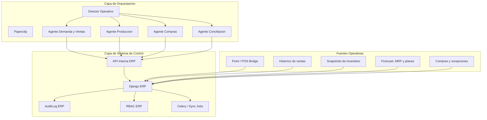

# Arquitectura de Orquestacion Paperclip + ERP

## 1. Objetivo

Definir una arquitectura donde `Paperclip` funcione como director/orquestador de agentes especialistas por area, mientras el ERP actual en Django/PostgreSQL sigue siendo la unica fuente de verdad para inventario, compras, produccion, ventas, costeo, auditoria y RBAC.

La meta no es reemplazar el ERP ni duplicar su control transaccional. La meta es agregar una capa de coordinacion y analisis que ayude a detectar riesgos, priorizar trabajo, pedir aprobaciones y preparar acciones operativas auditables.

## 2. Decision ejecutiva

Se recomienda un piloto de `Paperclip` en modo `orquestador`, no en modo `sistema principal`.

Decisiones no negociables:

- El ERP mantiene la fuente de verdad.
- Ningun agente escribe directo en tablas del ERP.
- Cualquier accion sensible se ejecuta por API o comando controlado del ERP.
- Toda accion aprobada debe dejar rastro en la bitacora del ERP.
- La Fase 1 sera de lectura, recomendacion y coordinacion; no de automatizacion transaccional abierta.

## 3. Principios de control

- Inventario, costeo, produccion, compras y cierres permanecen dentro del ERP.
- Paperclip solo observa, analiza, prioriza, propone y escala.
- Los agentes deben tener permisos minimos por dominio.
- Toda integracion debe ser reversible sin afectar la operacion del ERP.
- Las reglas de vida util, conciliacion, trazabilidad y RBAC tienen prioridad sobre la automatizacion.

## 4. Arquitectura objetivo

## 5. Organigrama de agentes

### 5.1 Director Operativo

Responsabilidad:

- Leer el estado operativo consolidado.
- Detectar riesgos, cuellos de botella y excepciones.
- Delegar analisis a agentes especialistas.
- Entregar resumen diario, semanal y de temporada.

Entradas:

- KPIs de ventas
- stock critico
- jobs fallidos
- discrepancias Point vs ERP
- planes de produccion
- solicitudes de compra abiertas

Salidas:

- resumen ejecutivo
- issues operativos
- solicitudes de revision
- prioridades del dia

Permisos iniciales:

- lectura consolidada
- apertura de tareas o incidencias fuera del core transaccional
- sin permisos de escritura operacional en compras, inventario o produccion

### 5.2 Agente de Demanda y Ventas

Responsabilidad:

- Analizar historico de ventas por sucursal, fecha y categoria.
- Detectar horarios fuertes por sucursal.
- Calcular stock minimo de arranque del dia.
- Alertar fechas comerciales fuertes con anticipacion.
- Detectar necesidad de producto especial.
- Coordinar demanda validada con produccion y compras.

Entradas:

- ventas historicas
- forecast actual
- stock actual
- low stock
- calendario comercial
- horarios de entrega por sucursal

Salidas:

- recomendacion de demanda esperada
- alerta de quiebre probable
- stock inicial sugerido por sucursal
- alerta de temporada fuerte
- propuesta de producto especial para aprobacion

Permisos iniciales:

- solo lectura
- creacion de issue o recomendacion
- sin alta de productos
- sin confirmacion de produccion
- sin movimiento de inventario

### 5.3 Agente de Produccion

Responsabilidad:

- Convertir demanda validada en necesidad productiva.
- Revisar capacidad, merma y vida util.
- Proponer plan de produccion por fecha y sucursal.
- Escalar riesgos de sobreproduccion o subabasto.

Entradas:

- forecast y demanda validada
- recetas y presentaciones
- MRP
- reglas de vida util
- capacidad operativa

Salidas:

- propuesta de plan de produccion
- alertas por capacidad
- alertas por vida util
- recomendacion de ventana de produccion

Permisos iniciales:

- lectura
- recomendacion
- solicitud de aprobacion
- sin ejecucion automatica de plan

### 5.4 Agente de Compras

Responsabilidad:

- Convertir plan validado en necesidad de insumos.
- Revisar stock, punto de reorden y lead times.
- Proponer solicitudes de compra.
- Detectar proveedores o insumos criticos.

Entradas:

- stock disponible
- sugerencias de compra
- necesidades derivadas de produccion
- proveedores y lead times

Salidas:

- propuesta de solicitud de compra
- alerta de quiebre de insumo
- alerta de proveedor critico
- prioridad por fecha y sucursal

Permisos iniciales:

- lectura
- recomendacion
- preparacion de solicitud para humano
- sin aprobacion automatica
- sin recepcion automatica

### 5.5 Agente de Conciliacion

Responsabilidad:

- Revisar diferencias entre ventas, produccion, transferencias e inventario.
- Vigilar consistencia Point vs ERP.
- Abrir incidencias con trazabilidad.
- Ayudar a cerrar el ciclo de auditoria.

Entradas:

- discrepancias
- jobs de sincronizacion
- auditoria
- historico materializado

Salidas:

- issue o hallazgo documentado
- prioridad de investigacion
- resumen de excepciones

Permisos iniciales:

- lectura
- creacion de incidencias
- sin correccion automatica de datos

## 6. Flujo operativo entre agentes

### 6.1 Flujo diario

1. Director Operativo revisa estado general al inicio del dia.
2. Agente de Demanda y Ventas calcula demanda esperada y stock minimo de arranque.
3. Agente de Produccion valida si la demanda esperada cabe en capacidad y vida util.
4. Agente de Compras revisa si el plan propuesto puede sostenerse con insumos disponibles.
5. Agente de Conciliacion vigila si la operacion real se desvía del plan.
6. Director Operativo consolida alertas y solicita aprobaciones cuando aplique.

### 6.2 Flujo de temporada fuerte

1. Agente de Demanda y Ventas detecta una fecha fuerte con 2 a 6 semanas de anticipacion.
2. Si se requiere producto especial, abre una recomendacion para aprobacion comercial o de direccion.
3. Una vez aprobado, Agente de Produccion propone ventana de fabricacion y cantidades.
4. Agente de Compras propone abastecimiento derivado.
5. Director Operativo da seguimiento a la preparacion y a los riesgos de ejecucion.

## 7. Endpoints y capacidades ERP a reutilizar

Los siguientes endpoints ya existen y permiten un piloto sin crear un motor nuevo:

### 7.1 Lectura segura

- `GET /api/pos-bridge/sales/summary/`
- `GET /api/pos-bridge/sales/by-branch/`
- `GET /api/pos-bridge/sales/by-product/`
- `GET /api/pos-bridge/sales/trends/`
- `GET /api/pos-bridge/inventory/current/`
- `GET /api/pos-bridge/inventory/availability/`
- `GET /api/pos-bridge/inventory/low-stock/`
- `GET /api/pos-bridge/sync-jobs/`
- `GET /api/audit/logs/`
- `GET /api/control/discrepancias/`
- `GET /api/inventario/sugerencias-compra/`
- `GET /api/ventas/pronostico/`
- `GET /api/ventas/historial/`
- `GET /api/reportes/bi/dashboard/`

### 7.2 Acciones controladas permitidas en Fase 1

- `POST /api/pos-bridge/sync-jobs/trigger/`

### 7.3 Acciones controladas candidatas para Fase 2

- `POST /api/mrp/calcular-requerimientos/`
- `POST /api/mrp/generar-plan-pronostico/`
- `POST /api/pos-bridge/product-closures/build/`
- `POST /api/pos-bridge/product-closures/<id>/lock/`
- `POST /api/compras/solicitud/`

Nota:

- Las acciones de Fase 2 no deben activarse sin aprobacion humana, RBAC especifico y registro doble en bitacora del ERP.

## 8. Datos faltantes que se deben confirmar

Hoy no conviene asumir estos datos. Si no existen de forma estructurada, deben levantarse antes de ampliar autonomia:

- horarios reales de entrega por sucursal
- hora de apertura y primera ventana critica de venta por sucursal
- capacidad de produccion por linea, dia y turno
- reglas operativas de stock minimo por categoria o sucursal
- merma historica por producto, categoria y sucursal
- calendario comercial anual oficial
- lead time real por proveedor
- proceso formal para autorizar productos especiales
- granularidad horaria real del historico de ventas

## 9. Fase 1 recomendada

### Alcance

- instalar Paperclip aparte del repo del ERP
- configurar 4 agentes
- conectar solo endpoints de lectura
- habilitar una unica accion segura: disparo de sync jobs
- producir resumenes, alertas y recomendaciones

### Checklist

- crear credencial tecnica con alcance minimo
- documentar que datos lee cada agente
- definir prompts y umbrales por agente
- definir aprobador humano por tipo de accion
- verificar que toda accion aprobada deje bitacora en ERP
- probar con 1 o 2 sucursales antes de escalar

### Criterios de aceptacion

- cero impacto negativo en la operacion transaccional
- alertas utiles y accionables
- falsos positivos en rango aceptable
- visibilidad diaria de riesgos de stock, demanda y conciliacion
- capacidad de apagar la integracion sin romper el ERP

## 10. Permisos y seguridad

Modelo recomendado:

- Paperclip usa un usuario tecnico propio.
- Cada agente consume solo endpoints necesarios para su dominio.
- Toda accion sensible requiere aprobacion humana al inicio.
- El ERP conserva el RBAC operativo y la bitacora final.
- No se exponen secretos del ERP dentro de prompts de negocio.

No recomendado:

- acceso amplio a todas las APIs internas
- uso de credenciales de administrador real
- escritura directa a base de datos
- agentes con permisos cruzados no justificados

## 11. Implementacion incremental

### Paso 1

- montar Paperclip en infraestructura separada
- conectar autenticacion al ERP con token tecnico
- registrar solo agentes de lectura

### Paso 2

- activar Director Operativo y Demanda/Ventas
- validar stock minimo de arranque y alertas de temporada

### Paso 3

- activar Produccion y Compras con propuestas, no ejecucion
- medir calidad de recomendaciones

### Paso 4

- activar una o dos acciones controladas con aprobacion humana
- revisar bitacora, tiempos de respuesta y errores

## 12. Riesgos y mitigaciones

### Riesgo: duplicar control operativo fuera del ERP

Mitigacion:

- prohibir escrituras directas
- exigir que el ERP ejecute y registre cualquier cambio

### Riesgo: recomendaciones pobres por falta de datos horarios o de capacidad

Mitigacion:

- limitar el piloto a lectura y coordinacion
- cargar datos faltantes antes de ampliar alcance

### Riesgo: demasiados agentes desde el inicio

Mitigacion:

- iniciar con 4 agentes maximo
- expandir solo si hay valor probado

### Riesgo: perdida de trazabilidad

Mitigacion:

- registrar acciones finales en `AuditLog`
- mantener aprobaciones humanas para acciones sensibles

## 13. Rollback

Si la capa de Paperclip no aporta valor o genera riesgo:

1. apagar Paperclip
2. revocar token tecnico y secretos asociados
3. desactivar adapters/webhooks
4. dejar al ERP operando exactamente como hoy

La arquitectura propuesta no debe introducir dependencias duras del ERP hacia Paperclip.

## 14. Estado recomendado

- Fecha: 2026-03-29
- Owner sugerido: Direccion General + Operaciones + Tecnologia
- Estado recomendado: `Propuesto para piloto controlado`
