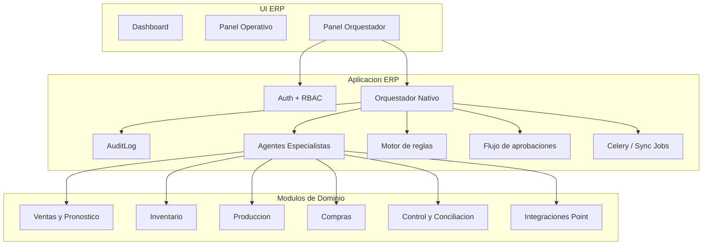

# Arquitectura de Orquestador Nativo del ERP

## 1. Objetivo

Diseñar una capacidad propia del ERP para operar un `director/orquestador` y un conjunto de agentes especialistas, sin depender del runtime de una plataforma externa y sin comprometer la fuente de verdad del sistema.

Estado 2026-04-14:

- la ruta activa `/ia-privada/` ya migró a un chat nativo del ERP
- PostgreSQL es la base conversacional oficial
- cualquier runtime externo legado debe tratarse como infraestructura ya retirada del flujo oficial

Estado verificado 2026-04-15:

- Railway ya sirve el chat nativo con modelo activo
- el chat nativo ya responde en streaming
- la continuidad conversacional basica ya fue validada en el entorno real
- una tool real del ERP ya fue ejecutada dentro del hilo conversacional

Referencia operativa:

- ver `docs/OPERACION_CHAT_NATIVO_ERP.md`

El objetivo no es crear "IA suelta" ni reemplazar los modulos existentes. El objetivo es coordinar instrucciones, automatizaciones y decisiones operativas ya presentes en el ERP para:

- detectar riesgos antes de que afecten la operacion
- delegar trabajo a agentes por dominio
- encadenar ventas, produccion y compras
- pedir aprobaciones humanas cuando aplique
- dejar trazabilidad completa en el ERP

## 2. Decision

Se propone implementar un `Orquestador Nativo ERP` dentro de la arquitectura Django/Celery/PostgreSQL ya existente.

Principios obligatorios:

- el ERP sigue siendo la unica fuente de verdad
- el orquestador no escribe directo en tablas de dominio fuera de servicios controlados
- toda accion material se ejecuta a traves de APIs internas, comandos o servicios existentes
- toda accion relevante deja rastro en `AuditLog`
- la autonomia se habilita por fases

## 3. Posicion dentro de la arquitectura actual

## 4. Bounded contexts

El orquestador debe vivir como un bounded context propio, sin invadir la responsabilidad transaccional de los modulos ya existentes.

### 4.1 Contexto nuevo: `orquestacion`

Responsabilidad:

- catalogo de agentes
- registro de capacidades
- reglas de delegacion
- evaluacion de eventos y señales
- asignacion de tareas
- aprobaciones y escalamiento
- trazabilidad operativa del trabajo del orquestador

No responsabilidad:

- movimientos de inventario
- aprobacion final de compras
- confirmacion de produccion
- cierre financiero o de inventario

### 4.2 Contextos consumidores

- `ventas`: historico, forecast, estacionalidad y pipeline
- `inventario`: stock actual, stock minimo, alertas, quiebres
- `produccion`: MRP, recetas, capacidades, vida util
- `compras`: solicitudes, ordenes, recepciones, lead times
- `control`: discrepancias, merma, auditoria de excepciones
- `integraciones`: POS Bridge, jobs, sincronizaciones y errores

## 5. Organigrama operativo propuesto

### 5.1 Director Operativo

Rol:

- coordinar prioridades
- interpretar alertas cruzadas
- decidir a que agente delegar
- consolidar resumen diario y semanal

Puede:

- leer KPIs y estado operativo consolidado
- abrir tareas internas
- disparar recomendaciones y solicitudes de aprobacion

No puede:

- ejecutar cambios transaccionales directos

### 5.2 Agente de Demanda y Ventas

Rol:

- proyectar demanda
- identificar horarios fuertes por sucursal
- proponer stock minimo de arranque
- detectar fechas fuertes y productos especiales

Puede:

- leer ventas historicas, pronostico, stock y low stock
- crear recomendaciones de demanda

No puede:

- confirmar produccion
- crear productos especiales solo

### 5.3 Agente de Produccion

Rol:

- convertir demanda validada en plan de produccion
- vigilar capacidad, merma y vida util

Puede:

- leer MRP, recetas, forecast y restricciones operativas
- proponer cantidades y ventanas

No puede:

- ejecutar planes en automatico

### 5.4 Agente de Compras

Rol:

- convertir plan validado en necesidad de insumos
- priorizar abastecimiento segun riesgo

Puede:

- leer stock, puntos de reorden, sugerencias y lead times
- preparar borradores de solicitud

No puede:

- aprobar ordenes
- registrar recepciones

### 5.5 Agente de Conciliacion

Rol:

- detectar desviaciones entre venta, produccion, transferencias e inventario
- vigilar integridad de Point vs ERP

Puede:

- leer discrepancias, jobs y bitacora
- abrir hallazgos

No puede:

- corregir historicos automaticamente

## 6. Modelo de datos propuesto

La implementacion puede iniciar con un app nuevo, por ejemplo `orquestacion`.

### 6.1 `AgentDefinition`

Describe el catalogo de agentes disponibles.

Campos sugeridos:

- `code`
- `name`
- `domain`
- `status` (`draft`, `active`, `paused`, `retired`)
- `description`
- `owner_department`
- `system_prompt_version`
- `allowed_tools_json`
- `allowed_actions_json`
- `requires_human_approval_default`
- `priority_order`

Uso:

- permite "dar de alta" o "desactivar" agentes sin tocar logica central
- evita que el sistema "contrate" agentes libremente sin control

### 6.2 `AgentCapability`

Define que sabe hacer cada agente.

Campos sugeridos:

- `agent_id`
- `capability_key`
- `scope_type` (`read`, `recommend`, `request_approval`, `trigger_action`)
- `resource_key`
- `branch_scope`
- `active`

Ejemplos:

- `sales.read.summary`
- `inventory.read.low_stock`
- `purchasing.recommend.request`
- `integrations.trigger.sync_jobs`

### 6.3 `OrchestrationRule`

Regla declarativa de delegacion y encadenamiento.

Campos sugeridos:

- `code`
- `name`
- `trigger_type` (`event`, `schedule`, `manual`, `threshold`)
- `source_event`
- `condition_json`
- `primary_agent_id`
- `secondary_agent_id`
- `action_mode` (`observe`, `recommend`, `approval_required`)
- `cooldown_minutes`
- `is_active`

Ejemplo:

- si `inventory.low_stock_detected` y `expected_demand > stock_arranque`, delegar a `Agente de Compras` y notificar a `Director Operativo`

### 6.4 `OrchestrationRun`

Registro de cada evaluacion del orquestador.

Campos sugeridos:

- `run_key`
- `trigger_source`
- `rule_id`
- `status`
- `started_at`
- `finished_at`
- `context_json`
- `result_summary_json`
- `created_by`

Uso:

- permite replay
- permite analisis de efectividad
- mantiene trazabilidad

### 6.5 `AgentTask`

Tarea concreta delegada a un agente.

Campos sugeridos:

- `run_id`
- `agent_id`
- `title`
- `task_type`
- `priority`
- `status`
- `input_payload`
- `output_payload`
- `assigned_branch`
- `due_at`
- `resolution_note`

Uso:

- historico de trabajo y decisiones por agente

### 6.6 `AgentSuggestion`

Recomendaciones producidas por los agentes.

Campos sugeridos:

- `task_id`
- `suggestion_type`
- `domain`
- `severity`
- `summary`
- `details_json`
- `recommended_action`
- `requires_approval`
- `approved_by`
- `approved_at`
- `rejected_by`
- `rejected_at`

Ejemplos:

- aumentar stock de arranque
- disparar sync job
- preparar solicitud de compra
- validar producto especial

### 6.7 `AgentExecutionLink`

Relaciona una sugerencia con una accion real ejecutada por el ERP.

Campos sugeridos:

- `suggestion_id`
- `execution_mode` (`api`, `command`, `service`)
- `target_reference`
- `execution_status`
- `audit_log_id`
- `executed_by`
- `executed_at`

Uso:

- garantiza que la recomendacion y la accion final queden unidas

### 6.8 `AgentGap`

Registro de huecos operativos donde conviene crear o dividir agentes.

Campos sugeridos:

- `gap_type`
- `detected_by_rule`
- `summary`
- `evidence_json`
- `suggested_agent_name`
- `status`
- `reviewed_by`

Uso:

- permite que el sistema recomiende "necesitamos un agente de logistica"
- pero la aprobacion sigue siendo humana

## 7. Motor de orquestacion

### 7.1 Tipos de disparadores

- `manual`
- `programado`
- `evento de dominio`
- `umbral`
- `excepcion`

Ejemplos:

- inicio de dia por sucursal
- venta historica con patron anormal
- quiebre de stock
- fallo de sync job
- fecha fuerte detectada a 30 dias

### 7.2 Productores de eventos

Productores iniciales recomendados:

- POS Bridge
- forecast y ventas
- inventario low stock
- sugerencias de compra
- MRP
- discrepancias
- jobs de integracion

### 7.3 Consumidores iniciales

- Director Operativo
- Demanda y Ventas
- Produccion
- Compras
- Conciliacion

### 7.4 Idempotencia

Reglas necesarias:

- cada corrida debe tener `run_key` unico
- reglas con `cooldown`
- no generar la misma sugerencia multiples veces por la misma condicion
- no disparar acciones repetidas sin nueva evidencia

## 8. Flujos clave

### 8.1 Flujo de stock de arranque

1. Scheduler de inicio del dia dispara evento por sucursal.
2. Agente de Demanda y Ventas estima demanda de apertura.
3. Compara contra stock actual y contra horario esperado de reposicion.
4. Si hay riesgo:
   - crea sugerencia
   - notifica al Director Operativo
   - si aplica, delega a Compras o Produccion

### 8.2 Flujo de fecha fuerte

1. Agente de Demanda y Ventas detecta patron o evento comercial.
2. Crea sugerencia de temporada.
3. Si requiere producto especial, solicita aprobacion comercial o de direccion.
4. Tras aprobacion:
   - Produccion propone plan
   - Compras propone abastecimiento
   - Director Operativo da seguimiento

### 8.3 Flujo de discrepancia Point vs ERP

1. Se detecta discrepancy o job fallido.
2. Agente de Conciliacion toma el caso.
3. Si requiere analisis de demanda o reabasto, delega a otros agentes.
4. Se documenta resolucion y se liga a `AuditLog`.

## 9. UI propuesta

No hace falta una UI compleja desde el inicio. Bastan tres vistas.

### 9.1 Panel de organigrama

Muestra:

- agentes activos
- estado
- dominio
- permisos
- metricas de uso
- agentes sugeridos por el sistema

### 9.2 Cola operativa del orquestador

Muestra:

- tareas abiertas
- sugerencias pendientes
- aprobaciones requeridas
- acciones ejecutadas
- errores y excepciones

### 9.3 Vista de detalle de corrida

Muestra:

- trigger
- reglas evaluadas
- agentes que participaron
- recomendaciones generadas
- acciones finales ejecutadas
- enlace a bitacora del ERP

## 10. RBAC y gobierno

El orquestador debe respetar y extender el modelo actual de roles en [core/access.py](/Users/mauricioburgos/Downloads/pastelerias_erp_sprint1/core/access.py).

Propuesta de permisos nuevos:

- `orquestacion.view_dashboard`
- `orquestacion.view_runs`
- `orquestacion.manage_rules`
- `orquestacion.approve_actions`
- `orquestacion.manage_agents`
- `orquestacion.execute_safe_actions`

Regla:

- los agentes no heredan permisos de superusuario
- el usuario tecnico del orquestador tiene permisos minimos y trazables
- aprobaciones de acciones sensibles quedan reservadas a `DG` y `ADMIN`

## 11. Contratos de integracion

El orquestador debe consumir contratos estables del ERP.

Lectura inicial recomendada:

- `GET /api/pos-bridge/sales/summary/`
- `GET /api/pos-bridge/sales/by-branch/`
- `GET /api/pos-bridge/sales/trends/`
- `GET /api/pos-bridge/inventory/current/`
- `GET /api/pos-bridge/inventory/low-stock/`
- `GET /api/pos-bridge/sync-jobs/`
- `GET /api/control/discrepancias/`
- `GET /api/inventario/sugerencias-compra/`
- `GET /api/audit/logs/`

Acciones seguras candidatas:

- `POST /api/pos-bridge/sync-jobs/trigger/`
- `POST /api/mrp/calcular-requerimientos/`

Acciones sensibles solo con aprobacion:

- `POST /api/compras/solicitud/`
- `POST /api/pos-bridge/product-closures/build/`
- `POST /api/pos-bridge/product-closures/<id>/lock/`

## 12. Datos faltantes

Para que el orquestador sea realmente fuerte, aun faltan o deben confirmarse:

- horarios reales de entrega por sucursal
- tiempo entre produccion y recepcion en sucursal
- capacidad productiva por linea y turno
- reglas de stock minimo por categoria
- merma historica por sucursal y producto
- calendario comercial oficial
- lead time real por proveedor
- proceso formal de aprobacion de producto especial
- granularidad horaria confiable de ventas

## 13. Backlog incremental

### Fase 0 - Diseno y gobierno

- crear ADR de orquestador nativo
- validar ownership por area
- aprobar matriz de permisos

### Fase 1 - Infraestructura minima

- crear app `orquestacion`
- crear modelos base
- crear panel de solo lectura
- crear scheduler y `OrchestrationRun`

### Fase 2 - Agentes de lectura y recomendacion

- Director Operativo
- Demanda y Ventas
- Produccion
- Compras
- Conciliacion

### Fase 3 - Aprobaciones y acciones seguras

- flujo de aprobacion en UI
- disparo de sync jobs
- calculos MRP on-demand

### Fase 4 - Acciones operativas controladas

- preparacion de solicitudes de compra
- build controlado de cierres
- seguimiento de productos especiales

## 14. Criterios de aceptacion

- el ERP sigue funcionando sin depender del orquestador
- toda accion final queda auditada en el ERP
- no hay escrituras directas fuera de servicios controlados
- las recomendaciones mejoran deteccion temprana de riesgo
- el sistema puede sugerir necesidad de nuevos agentes sin crearlos automaticamente

## 15. Rollback

Si la iniciativa no aporta valor:

1. pausar reglas y scheduler de `orquestacion`
2. desactivar agentes
3. mantener historico para analisis
4. no afectar modulos transaccionales

Como esta arquitectura es nativa y desacoplada, el rollback debe ser administrativo y no destructivo.

## 16. Estado recomendado

- Fecha: 2026-03-29
- Owner sugerido: Direccion General + Tecnologia + Operaciones
- Estado: `Propuesto para implementacion gradual`
