# ARQUITECTURA Y ROADMAP - Mini-ERP Pastelerías

## 1. ARQUITECTURA DEL SISTEMA

```mermaid
graph TB
    subgraph "CAPA DE PRESENTACIÓN"
        DA[Django Admin UI]
        API[REST API Endpoints]
    end
    
    subgraph "CAPA DE APLICACIÓN"
        AUTH[Auth & RBAC]
        AUDIT[Audit Log Service]
        
        subgraph "MÓDULOS DE NEGOCIO"
            BUDGET[Presupuestos]
            RECIPE[Recetas & Costeo]
            MRP[MRP Ligero]
            INV[Inventario Central]
            PURCH[Compras]
            PROD[Producción]
            ASSETS[Activos & Mant.]
            CONTROL[Control & Reportes]
        end
        
        subgraph "SERVICIOS TRANSVERSALES"
            IMPORT[Importadores]
            MATCH[Matching Engine]
            APPROVAL[Workflow Aprobaciones]
            ALERT[Alertas]
        end
    end
    
    subgraph "CAPA DE DATOS"
        PG[(PostgreSQL)]
    end
    
    subgraph "INTEGRACIONES EXTERNAS"
        POS[POS Bsale - Import CSV/API]
        CONT[Contabilidad CONTPAQi - Export]
        EXCEL[Excels Actuales - Import/Export]
    end
    
    DA --> AUTH
    API --> AUTH
    AUTH --> AUDIT
    
    BUDGET --> APPROVAL
    PURCH --> APPROVAL
    MRP --> RECIPE
    MRP --> INV
    PURCH --> INV
    PROD --> RECIPE
    PROD --> INV
    CONTROL --> POS
    
    IMPORT --> MATCH
    IMPORT --> PG
    RECIPE --> PG
    BUDGET --> PG
    INV --> PG
    PURCH --> PG
    PROD --> PG
    ASSETS --> PG
    CONTROL --> PG
    APPROVAL --> AUDIT
```



## 2. STACK TECNOLÓGICO

### Backend
- **Framework**: Django 5.0 + Django REST Framework 3.14
- **Base de Datos**: PostgreSQL 16
- **Procesamiento**: pandas 2.2.0, openpyxl 3.1.2
- **Matching**: rapidfuzz 3.6.1
- **Orquestación**: docker-compose

### Frontend (Temporal - Sprint 1)
- Django Admin (altamente customizado)
- Pantallas simples HTML/HTMX donde aporte valor

## 3. MODELO DE DATOS v1

### CORE (Fundación)

#### Sucursal
```sql
CREATE TABLE core_sucursal (
    id UUID PRIMARY KEY DEFAULT gen_random_uuid(),
    codigo VARCHAR(20) UNIQUE NOT NULL,
    nombre VARCHAR(100) NOT NULL,
    direccion TEXT,
    telefono VARCHAR(20),
    es_almacen_central BOOLEAN DEFAULT FALSE,
    activo BOOLEAN DEFAULT TRUE,
    created_at TIMESTAMP DEFAULT NOW(),
    updated_at TIMESTAMP DEFAULT NOW()
);
```

#### Departamento
```sql
CREATE TABLE core_departamento (
    id UUID PRIMARY KEY DEFAULT gen_random_uuid(),
    codigo VARCHAR(20) UNIQUE NOT NULL,  -- PROD, VENTAS, COMPRAS, etc.
    nombre VARCHAR(100) NOT NULL,
    descripcion TEXT,
    activo BOOLEAN DEFAULT TRUE
);
```

#### Usuario
```sql
CREATE TABLE core_usuario (
    id UUID PRIMARY KEY DEFAULT gen_random_uuid(),
    username VARCHAR(150) UNIQUE NOT NULL,
    email VARCHAR(254) UNIQUE NOT NULL,
    password_hash VARCHAR(255) NOT NULL,
    nombre_completo VARCHAR(200) NOT NULL,
    departamento_id UUID REFERENCES core_departamento,
    sucursal_id UUID REFERENCES core_sucursal,
    rol VARCHAR(50) NOT NULL,  -- DG, ADMIN, COMPRAS, ALMACEN, etc.
    activo BOOLEAN DEFAULT TRUE,
    created_at TIMESTAMP DEFAULT NOW(),
    last_login TIMESTAMP
);
```

#### AuditLog
```sql
CREATE TABLE core_auditlog (
    id UUID PRIMARY KEY DEFAULT gen_random_uuid(),
    usuario_id UUID REFERENCES core_usuario,
    accion VARCHAR(50) NOT NULL,  -- CREATE, UPDATE, DELETE, APPROVE, REJECT
    entidad VARCHAR(100) NOT NULL,
    entidad_id UUID NOT NULL,
    datos_anteriores JSONB,
    datos_nuevos JSONB,
    ip_address INET,
    user_agent TEXT,
    timestamp TIMESTAMP NOT NULL DEFAULT NOW()
);

CREATE INDEX idx_auditlog_entidad ON core_auditlog(entidad, entidad_id);
CREATE INDEX idx_auditlog_usuario ON core_auditlog(usuario_id, timestamp);
CREATE INDEX idx_auditlog_timestamp ON core_auditlog(timestamp);
```

### MAESTROS

#### Proveedor
```sql
CREATE TABLE maestros_proveedor (
    id UUID PRIMARY KEY DEFAULT gen_random_uuid(),
    codigo VARCHAR(20) UNIQUE NOT NULL,
    razon_social VARCHAR(200) NOT NULL,
    nombre_comercial VARCHAR(200),
    rfc VARCHAR(13),
    contacto_nombre VARCHAR(100),
    contacto_telefono VARCHAR(20),
    contacto_email VARCHAR(254),
    direccion TEXT,
    forma_pago VARCHAR(50),
    lead_time_dias INTEGER DEFAULT 7,
    calificacion DECIMAL(3,2),
    notas TEXT,
    activo BOOLEAN DEFAULT TRUE,
    created_at TIMESTAMP DEFAULT NOW(),
    updated_at TIMESTAMP DEFAULT NOW()
);
```

#### UnidadMedida
```sql
CREATE TABLE maestros_unidadmedida (
    id UUID PRIMARY KEY DEFAULT gen_random_uuid(),
    codigo VARCHAR(10) UNIQUE NOT NULL,  -- KG, L, PZ, GR, ML
    nombre VARCHAR(50) NOT NULL,
    tipo VARCHAR(20) NOT NULL,  -- PESO, VOLUMEN, UNIDAD
    activo BOOLEAN DEFAULT TRUE
);
```

#### CategoriaInsumo
```sql
CREATE TABLE maestros_categoriainsumo (
    id UUID PRIMARY KEY DEFAULT gen_random_uuid(),
    codigo VARCHAR(20) UNIQUE NOT NULL,
    nombre VARCHAR(100) NOT NULL,
    descripcion TEXT,
    activo BOOLEAN DEFAULT TRUE
);
```

#### Insumo
```sql
CREATE TABLE maestros_insumo (
    id UUID PRIMARY KEY DEFAULT gen_random_uuid(),
    codigo VARCHAR(50) UNIQUE NOT NULL,
    nombre VARCHAR(200) NOT NULL,
    nombre_normalizado VARCHAR(200) NOT NULL,  -- sin acentos, minúsculas
    descripcion TEXT,
    categoria_id UUID REFERENCES maestros_categoriainsumo,
    unidad_medida_id UUID REFERENCES maestros_unidadmedida NOT NULL,
    es_perecedero BOOLEAN DEFAULT FALSE,
    vida_util_dias INTEGER,
    activo BOOLEAN DEFAULT TRUE,
    created_at TIMESTAMP DEFAULT NOW(),
    updated_at TIMESTAMP DEFAULT NOW()
);

CREATE INDEX idx_insumo_normalizado ON maestros_insumo(nombre_normalizado);
```

#### CostoInsumo (versionado histórico)
```sql
CREATE TABLE maestros_costoinsumo (
    id UUID PRIMARY KEY DEFAULT gen_random_uuid(),
    insumo_id UUID REFERENCES maestros_insumo NOT NULL,
    proveedor_id UUID REFERENCES maestros_proveedor,
    costo_unitario DECIMAL(12,4) NOT NULL,
    moneda VARCHAR(3) DEFAULT 'MXN',
    fecha_inicio DATE NOT NULL,
    fecha_fin DATE,  -- NULL = vigente
    fuente VARCHAR(50),  -- IMPORT_EXCEL, MANUAL, COTIZACION
    notas TEXT,
    activo BOOLEAN DEFAULT TRUE,
    created_at TIMESTAMP DEFAULT NOW()
);

CREATE UNIQUE INDEX idx_costoinsumo_vigente 
    ON maestros_costoinsumo(insumo_id, fecha_inicio) 
    WHERE activo = TRUE;

CREATE INDEX idx_costoinsumo_current 
    ON maestros_costoinsumo(insumo_id, fecha_fin) 
    WHERE fecha_fin IS NULL;
```

#### CategoriaProducto
```sql
CREATE TABLE maestros_categoriaproducto (
    id UUID PRIMARY KEY DEFAULT gen_random_uuid(),
    codigo VARCHAR(20) UNIQUE NOT NULL,
    nombre VARCHAR(100) NOT NULL,
    descripcion TEXT,
    activo BOOLEAN DEFAULT TRUE
);
```

#### Producto
```sql
CREATE TABLE maestros_producto (
    id UUID PRIMARY KEY DEFAULT gen_random_uuid(),
    codigo VARCHAR(50) UNIQUE NOT NULL,  -- SKU
    nombre VARCHAR(200) NOT NULL,
    descripcion TEXT,
    categoria_id UUID REFERENCES maestros_categoriaproducto,
    unidad_venta_id UUID REFERENCES maestros_unidadmedida NOT NULL,
    precio_venta_sugerido DECIMAL(12,2),
    activo BOOLEAN DEFAULT TRUE,
    created_at TIMESTAMP DEFAULT NOW(),
    updated_at TIMESTAMP DEFAULT NOW()
);
```

### RECETAS & COSTEO

#### Receta (versionada)
```sql
CREATE TABLE recetas_receta (
    id UUID PRIMARY KEY DEFAULT gen_random_uuid(),
    producto_id UUID REFERENCES maestros_producto NOT NULL,
    version INTEGER NOT NULL DEFAULT 1,
    nombre VARCHAR(200) NOT NULL,
    descripcion TEXT,
    cantidad_base DECIMAL(12,4) NOT NULL,
    unidad_base_id UUID REFERENCES maestros_unidadmedida NOT NULL,
    costo_materia_prima DECIMAL(12,4),  -- calculado
    costo_mano_obra DECIMAL(12,4),
    costo_indirectos DECIMAL(12,4),
    costo_total DECIMAL(12,4),  -- suma
    fecha_vigencia_inicio DATE NOT NULL,
    fecha_vigencia_fin DATE,
    estado VARCHAR(20) DEFAULT 'DRAFT',  -- DRAFT, ACTIVE, ARCHIVED
    notas TEXT,
    hash_contenido VARCHAR(64),  -- SHA256 para idempotencia
    created_by UUID REFERENCES core_usuario,
    created_at TIMESTAMP DEFAULT NOW(),
    updated_at TIMESTAMP DEFAULT NOW(),
    UNIQUE(producto_id, version)
);

CREATE INDEX idx_receta_activa ON recetas_receta(producto_id, estado) 
    WHERE estado = 'ACTIVE';
```

#### LineaReceta
```sql
CREATE TABLE recetas_lineareceta (
    id UUID PRIMARY KEY DEFAULT gen_random_uuid(),
    receta_id UUID REFERENCES recetas_receta NOT NULL,
    insumo_id UUID REFERENCES maestros_insumo NOT NULL,
    cantidad DECIMAL(12,4) NOT NULL,
    unidad_medida_id UUID REFERENCES maestros_unidadmedida NOT NULL,
    costo_unitario_snapshot DECIMAL(12,4),  -- costo al momento de crear
    costo_total DECIMAL(12,4),
    orden INTEGER DEFAULT 0,
    notas TEXT
);

CREATE INDEX idx_lineareceta_receta ON recetas_lineareceta(receta_id);
```

#### InsumoMatching (para importador)
```sql
CREATE TABLE recetas_insumomatching (
    id UUID PRIMARY KEY DEFAULT gen_random_uuid(),
    nombre_origen VARCHAR(200) NOT NULL,  -- del Excel
    nombre_normalizado_origen VARCHAR(200) NOT NULL,
    insumo_id UUID REFERENCES maestros_insumo,
    match_score DECIMAL(5,2),  -- 0-100
    match_type VARCHAR(20),  -- EXACT, CONTAINS, FUZZY, MANUAL, UNMATCHED
    estado VARCHAR(20) DEFAULT 'PENDING',  -- PENDING, APPROVED, REJECTED
    reviewed_by UUID REFERENCES core_usuario,
    reviewed_at TIMESTAMP,
    fuente_import VARCHAR(100),  -- nombre del archivo
    import_date TIMESTAMP DEFAULT NOW(),
    notas TEXT
);

CREATE INDEX idx_matching_estado ON recetas_insumomatching(estado);
CREATE INDEX idx_matching_origen ON recetas_insumomatching(nombre_normalizado_origen);
```

## 4. ROADMAP POR SPRINTS

### SPRINT 1: Fundación + Importación costeo/recetas ✅ ACTUAL
**Duración**: 3-4 días
**Objetivo**: Sistema base funcional con importación de costos y recetas

#### Definition of Done:
- ✅ Repo Django + Postgres funcionando en docker-compose
- ✅ Auth + RBAC implementado con roles definidos
- ✅ AuditLog general capturando todas las operaciones
- ✅ Models base creados y migrados
- ✅ Comando `python manage.py import_costeo COSTEO_Prueba.xlsx` funcional
- ✅ Importador idempotente (correr 2x no duplica)
- ✅ Matching automático insumos con umbrales (≥90 auto, 75-89 review, <75 sin match)
- ✅ Reportes CSV generados: resumen, errores, pendientes matching
- ✅ Django Admin configurado con filtros y totales de receta
- ✅ Endpoint `POST /api/mrp/explode` devuelve explosión de insumos + costo + warnings
- ✅ README con pasos exactos para correr y probar

#### Entregables:
1. Estructura del repo completa
2. docker-compose.yml funcional
3. Modelos + migraciones iniciales
4. Importador de costos y recetas
5. Admin customizado
6. API MRP básico
7. Tests unitarios de importador
8. Documentación de setup

---

### SPRINT 2: Costeo completo MP/MO/Indirectos + versionado
**Duración**: 3 días
**Objetivo**: Costeo integral con drivers y control de versiones

#### Definition of Done:
- ✅ Importar MO (mano de obra) desde hojas Excel
- ✅ Importar costos indirectos (drivers configurables)
- ✅ Drivers por producto/familia/lote
- ✅ Cálculo automático de costo total (MP + MO + Indirectos)
- ✅ Versionado de recetas automático al detectar cambios
- ✅ Histórico de costos consultable
- ✅ Reporte comparativo de versiones
- ✅ API: `GET /api/recetas/{id}/versiones`
- ✅ API: `GET /api/recetas/{id}/costo-historico`

---

### SPRINT 3: Pronóstico → Producción → MRP
**Duración**: 4 días
**Objetivo**: Planificación de producción basada en pronósticos

#### Definition of Done:
- ✅ Modelo de Pronóstico Ventas (por producto/periodo)
- ✅ Importador de pronósticos desde Excel
- ✅ Plan de Producción (cantidad a producir por periodo)
- ✅ Explosión MRP: de plan producción → requerimientos insumos agregados
- ✅ Reporte de requerimientos por periodo
- ✅ API: `POST /api/mrp/calcular-requerimientos`
- ✅ Admin: vista de plan de producción vs pronóstico
- ✅ Alertas de capacidad si requerimientos > stock disponible

---

### SPRINT 4: Inventario almacén central + sugerencia de compra
**Duración**: 5 días
**Objetivo**: Control de inventario central con cálculo de compras

#### Definition of Done:
- ✅ Modelo de Movimientos de Inventario (entrada, salida, ajuste, merma, transferencia)
- ✅ Conteos físicos y ajustes con aprobación ADMIN
- ✅ Stock en tránsito (OC emitidas pero no recibidas)
- ✅ Parámetros por insumo: stock_min, stock_max, reorder_point, stock_seguridad
- ✅ Algoritmo de sugerencia:
  ```
  compra_sugerida = (requerido_producción + stock_seguridad) - (disponible + en_tránsito)
  ```
- ✅ Consideración de lead_time proveedor
- ✅ Reporte de sugerencias de compra
- ✅ API: `GET /api/inventario/sugerencias-compra`
- ✅ Dashboard con alertas stock bajo/alto

---

### SPRINT 5: Compras end-to-end + aprobaciones
**Duración**: 5 días
**Objetivo**: Flujo completo de compras con workflow de aprobaciones

#### Definition of Done:
- ✅ Modelo: Solicitud de Compra (requisición)
- ✅ Workflow: cualquier área crea requisición
- ✅ Aprobación ADMIN (aprueba/rechaza con comentarios)
- ✅ Modelo: Orden de Compra (OC)
- ✅ Conversión: requisición aprobada → OC (por usuario COMPRAS)
- ✅ Modelo: Recepción (parcial/total)
- ✅ Registro de incidencias (faltantes, daños, retrasos)
- ✅ Actualización automática de inventario al recepcionar
- ✅ Presupuesto de compras mensual vs ejecutado
- ✅ API: `POST /api/compras/solicitud` → workflow automático
- ✅ Admin: bandeja de aprobaciones pendientes ADMIN
- ✅ Audit log completo del flujo

---

### SPRINT 6: Presupuestos por área + consolidado + aprobación DG
**Duración**: 4 días
**Objetivo**: Sistema de presupuestos con flujo de revisión y aprobación

#### Definition of Done:
- ✅ Modelo: Presupuesto (por departamento, periodo, versión)
- ✅ Captura/import por área (Excel o manual)
- ✅ Revisión ADMIN (solicita ajustes, aprueba para DG)
- ✅ Aprobación DG (congela versión)
- ✅ Modelo: PresupuestoReal (tracking mensual)
- ✅ Cálculo automático de variaciones (Real vs Presupuesto)
- ✅ Alertas si % desviación > umbral
- ✅ Reporte consolidado por área
- ✅ Dashboard ejecutivo para DG
- ✅ API: `GET /api/presupuestos/consolidado/{periodo}`
- ✅ Workflow de estados: DRAFT → EN_REVISION → APROBADO_ADMIN → APROBADO_DG

---

### SPRINT 7: Activos + mantenimiento
**Duración**: 4 días
**Objetivo**: Gestión de activos y mantenimiento preventivo/correctivo

#### Definition of Done:
- ✅ Modelo: Activo (equipos, maquinaria, instalaciones)
- ✅ Modelo: PlanMantenimiento (preventivo)
- ✅ Modelo: OrdenMantenimiento (correctivo)
- ✅ Calendario de mantenimientos
- ✅ Bitácora de intervenciones
- ✅ Registro de costos (repuestos, MO externa)
- ✅ Análisis de fallas recurrentes
- ✅ Recomendaciones de reemplazo (costo acumulado vs valor activo)
- ✅ API: `GET /api/activos/calendario-mantenimiento`
- ✅ Alertas de mantenimiento vencido
- ✅ Dashboard de disponibilidad de equipos

---

### SPRINT 8: Control discrepancias (con imports POS)
**Duración**: 5 días
**Objetivo**: Cruces y alertas para detectar inconsistencias

#### Definition of Done:
- ✅ Importador de ventas POS (CSV Bsale)
- ✅ Importador de mermas POS
- ✅ Modelo: VentaPOS, MermaPOS
- ✅ Cruce: ventas POS vs producción registrada
- ✅ Cruce: mermas POS vs mermas registradas en ERP
- ✅ Cruce: inventario teórico (producción - ventas - mermas) vs inventario real
- ✅ Algoritmo de detección de discrepancias:
  ```
  discrepancia = inventario_real - (produccion - ventas - mermas_registradas)
  ```
- ✅ Alertas automáticas si |discrepancia| > umbral
- ✅ Dashboard de control con semáforos
- ✅ Reporte de discrepancias por sucursal/periodo
- ✅ API: `GET /api/control/discrepancias`

---

## 5. NOTAS DE IMPLEMENTACIÓN

### Supuestos y Decisiones

1. **Almacén Central**: Foco inicial en inventario central. Movimientos a sucursales se registran como "salidas simples" sin control fino (ese control queda en POS).

2. **Matching de Insumos**: 
   - Normalización: sin acentos, minúsculas, trim
   - Umbrales: ≥90 auto-match, 75-89 needs review, <75 sin match
   - Matching manual disponible en Admin

3. **Versionado de Recetas**:
   - Hash SHA256 del contenido (ingredientes + cantidades)
   - Nueva versión automática si hash cambia en import
   - Solo 1 receta ACTIVE por producto

4. **Aprobaciones**:
   - Estados: PENDING → APPROVED/REJECTED
   - Audit log captura aprobador, fecha, comentarios
   - Email/notificación (Sprint posterior)

5. **Moneda**: MXN hard-coded, multi-currency en fase 2

6. **Fechas**: Timezone Mexico/Ciudad_de_Mexico

7. **Soft Deletes**: Campo `activo` en todos los modelos principales

8. **Hash para Idempotencia**: SHA256 de contenido clave para evitar duplicados en imports

---

## 6. PRÓXIMOS PASOS (Post-Sprint 8)

- **Sprint 9**: CRM básico (clientes, seguimiento pedidos)
- **Sprint 10**: RRHH (empleados, nómina básica)
- **Sprint 11**: Logística (rutas, entregas)
- **Sprint 12**: Reportes avanzados y BI
- **Sprint 13**: API pública para integraciones
- **Sprint 14**: Mobile app para captura en piso
- **Sprint 15**: UI moderna (React/Vue) para módulos críticos
