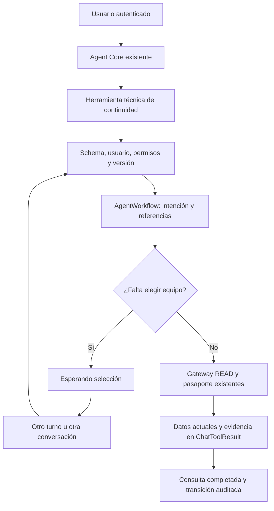

# F4.1/F4.2 — continuidad de consultas de equipos

Alcance aprobado por Mauricio el 2026-10-07: una entidad técnica de procesos pendientes, migración aditiva, servicio/API e integración mínima en el Agent Core existente. Publicación con controles apagados. Este corte sólo consulta equipos y mantenimiento; guardar un pendiente no crea un registro operativo.

## Fuentes y estado

`AgentWorkflow` pertenece a un usuario ERP y conserva intención, campos faltantes, referencias, versión y control de ejecución. Reutiliza ChatConversation, ChatMessage, ChatToolCall/Result y AuditLog. [Ficha de fuentes](../data-reuse/ai-erp-workflows-read.md). No convierte AgentTask, AgentSuggestion ni SeguimientoItem, y no importa pendientes anteriores.

Las opciones son propias de cada proceso. Los nombres y el mantenimiento se resuelven nuevamente mediante el Gateway y el queryset canónico autorizado. Archivar el chat de origen no elimina el pendiente; continuarlo exige otro chat activo del mismo usuario. Un propietario eliminado deja el proceso inaccesible.

El único caso inicial es consultar ficha/mantenimiento de un equipo. El modelo propone herramientas; el servidor decide propietario, faltantes, estado, alcance y finalización. Una búsqueda común con varias coincidencias no crea un pendiente automáticamente. No hay clasificación por keywords.

## Seguridad y concurrencia

- Todos los gates deben estar habilitados explícitamente dentro de un entorno autorizado; por defecto permanecen apagados. No se modifica `.env` de producción ni se concede acceso a usuarios.
- Cada comando y proyección comprueba usuario vigente, ownership, schema y alcance actual. Los comandos vuelven a comprobar autorización después de adquirir el bloqueo de fila, incluidos replay y publicación de la lectura, y revalidan el estado nuevo después de una selección. Los IDs se vuelven a resolver; una opción revocada conserva su posición sin revelar datos.
- Actualización con `expected_version`, exclusión mediante lease y transacciones breves con `select_for_update`. El Gateway/proveedor se llama fuera del bloqueo transaccional.
- La clave de origen evita duplicar la intención. Repetir el último comando exige el mismo payload y autorización fresca; una versión antigua o una clave reutilizada con otros argumentos produce conflicto.
- Una ejecución interrumpida exige revalidación explícita. El token/versionado rechaza resultados tardíos. Esta recuperación sólo se permite para READ; no autoriza reintentar pagos o escrituras futuras.
- JSON acotado y allowlisted; no guardar historiales completos, costos, bancos, salarios, archivos, secretos, prompts ni razonamiento privado en el workflow. Las transiciones y AuditLog se guardan atómicamente. AuditLog no promete inmutabilidad física frente al administrador de BD.

No se fija una retención definitiva ni se purga evidencia. La expiración, cuando se configure en un proceso, es lógica y no borra sus datos.

## Contrato aditivo

| Ruta | Función | Efecto |
| --- | --- | --- |
| `GET /api/ai-gateway/workflows/` | Pendientes propios, filtros permitidos, página máxima de 20 | Sólo lectura; no ejecuta tools ni crea estado |
| `GET /api/ai-gateway/workflows/<uuid>/` | Estado, versión, faltantes y referencias autorizadas | Sólo lectura |
| `POST /api/ai-gateway/workflows/` | Preparar una intención con clave de origen y chat propio | Estado técnico |
| `PATCH /api/ai-gateway/workflows/<uuid>/` | Completar selección/información, cancelar o revalidar | Estado técnico; exige versión y clave de comando |
| `POST /api/ai-gateway/workflows/<uuid>/resume/` | Continuar en un chat propio activo | Gateway READ y estado técnico |

Errores del subset nuevo: `detail`, `code` y, cuando corresponda, `fields`. No cambia los contratos anteriores del Gateway. Datos inválidos: 400; autenticación/acceso/gates: 401/403; UUID no accesible: 404; conflictos de versión, clave o ejecución: 409. Los conflictos no exponen datos de procesos ajenos. Los códigos contractuales son `invalid_input`, `version_conflict`, `request_payload_mismatch`, `execution_in_progress`, `execution_interrupted`, `workflow_expired` y `unsupported_schema`. Un fallo inesperado devuelve 503 `workflow_failed` sin detalles internos.

El catálogo técnico se integra al mismo runtime detrás del gate F4. Las tres herramientas READ existentes conservan su schema y política. No se expone una función al modelo para conceder permisos, cambiar propietario, aprobar una operación o marcarla exitosa.

Las herramientas nuevas son `erp_prepare_asset_maintenance`, `erp_list_pending_workflows` y `erp_resume_asset_maintenance`. El tipo único es `CONSULT_ASSET_MAINTENANCE`. El servidor deriva las claves de origen/comando del mensaje real y el call ID; el modelo no proporciona actor, permisos o aprobación. La preparación acepta `query` o `asset_id`, no ambos. La herramienta de listado devuelve como máximo 20 pendientes vigentes recientes y no pagina; el API permite páginas de hasta 20. La expiración lógica y las huellas de permisos no vigentes se excluyen antes de tomar ese límite. La reanudación exige `workflow_id` y `expected_version`. Para completar un pendiente admite uno de `query`, `asset_id` u `option_position` propia de ese workflow; conserva el mismo UUID aunque todavía falten datos.

En el API, POST exige `kind`, `origin_request_id`, `conversation_id` y `payload`. PATCH exige `expected_version`, `request_id` y un payload con uno de `query`, `asset_id`, `option_position`, `cancel: true` o `revalidate: true`. Resume añade `conversation_id`: guarda avances parciales si aún falta información o selección, y ejecuta la consulta sólo cuando el servidor la encuentra lista. El DTO usa `public_id` como UUID público, `status`, `version`, `missing_fields`, `next_step`, `options` y fuentes/fechas; nunca devuelve `state_json` completo ni el hash de permisos. Los clientes deben conservar la misma clave y el mismo body al reintentar.

## Validación y publicación

Las pruebas usan PostgreSQL 16 exclusivo y datos ficticios. El proveedor se sustituye por un doble; servicios, Gateway, schemas, scopes, auditoría y estados se ejecutan realmente. Deben cubrir continuidad desde otro chat, datos faltantes, ambigüedad, límites, revocación, replay, colisiones, concurrencia, leases y fallos de auditoría sin escrituras operativas.

Validación local: 150 pruebas pasaron con PostgreSQL 16, incluyendo continuidad parcial desde otro chat con el mismo UUID, UUID/siguiente paso del DTO y correlación de mensajes. `check`, `migrate --check` y `makemigrations --check --dry-run` finalizaron sin errores ni cambios pendientes. Esta evidencia es local; CI y producción se verifican por separado.

La evaluación con OpenAI real del nuevo flujo es F4.3, independiente de estas pruebas. La evaluación previa F3 no demuestra interpretación del catálogo nuevo. La interfaz de pendientes es F5. Telegram, voz, documentos y acciones transaccionales requieren otros cortes; no se presentan como disponibles aquí.

Para publicar: revisión del diff y migración, checks PG16, CI, merge y `scripts/deploy_web_safe.sh` oficial. Verificar migración aplicada, gates apagados y endpoints protegidos en el servidor servido; comprobar que el chat existente sigue accesible. No ejecutar fixtures ni activar flags en producción.

Rollback: mantener gates apagados. Si se necesita retirar la integración, revertir por Git únicamente el API/runtime de este corte, conservando el modelo, su validador referenciado por la migración, la tabla, datos técnicos y migración aplicada. No revertir indiscriminadamente el commit completo: eso retiraría también la migración. No eliminar ni editar una migración aplicada, ni efectuar reversión destructiva de la base.

Recursos de prueba de esta tarea: Compose `erp_ai_workflows_read_20261007`, puerto PostgreSQL 55527, volumen exclusivo y propietario `codex-erp-ai-root`. El cierre exige respaldo verificable y retiro exacto de esos recursos, worktree/rama y pestañas de prueba. Evidencia de RED/GREEN, revisiones, CI, despliegue y limpieza se conserva fuera de Git en `~/.codex/task-artifacts/ai-erp-workflows-read-20261007/`; su presencia no sustituye verificar cada etapa.
