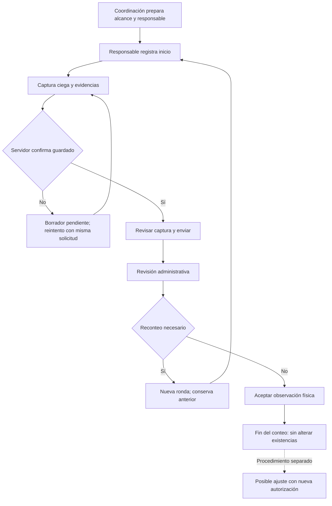

# Conteos físicos de sucursales

## Alcance de esta entrega

Captura y revisión independientes del inventario operativo. Aceptar confirma una observación física; no autoriza ni aplica un ajuste Point, una merma, consumo, compra, traslado, costo o asiento. No se utiliza `cerrar_conteo` del conteo mensual de CEDIS.

Entradas: `/app/conteos/` y `/inventario/conteos-sucursales/`. App Operativa muestra el acceso a coordinadores y personas con conteos visibles. La preparación permite combinar productos Point e insumos canónicos con código Point; congela nombre, código, unidad y evidencia de la unidad. Una caja no se transforma automáticamente en piezas.

## Flujo y responsabilidades

1. Coordinación define sucursal operativa, fecha programada, responsable y alcance. Se rechazan duplicados activos por artículo/sucursal/fecha, incluso cuando el mismo código aparece como producto e insumo. Máximo 2,000 artículos por conteo; para el piloto conviene una categoría pequeña.
2. Responsable llega a la sucursal y pulsa **Comenzar conteo**. Se registra hora de servidor por ronda. La fecha programada no sustituye esta evidencia temporal.
3. Captura ciega: sin stock esperado ni cantidades de rondas anteriores. Cero es una observación; vacío requiere contar o justificar una incidencia. Hallazgos fuera del alcance se anotan, sin crear maestros.
4. **Guardar avance** confirma recepción en servidor. Los borradores del dispositivo no equivalen a envío; la interfaz distingue ambos estados. Al enviar, el servidor exige cantidad o incidencia por artículo y conserva una instantánea.
5. Revisor consulta la referencia disponible o solicita un reconteo selectivo con motivo. Cada ronda conserva las anteriores; un reconteo invalida la referencia actual y exige nuevo inicio. El responsable ve el motivo y una captura nueva.
6. Revisor acepta la observación con conclusión. Un ajuste requiere un procedimiento y autorización diferentes, fuera de esta entrega. Se puede exportar el resultado y el historial a Excel.

## Permisos y separación

Coordinación reutiliza la política administrativa existente o el permiso de gestión `inventario.conteos_sucursales`. La persona asignada debe conservar su sucursal en el perfil o un acceso explícito vigente. Los permisos específicos por sucursal se administran mediante `AccesoConteoSucursal` en Django Admin y quedan en su bitácora; no se crean permisos automáticamente durante el despliegue.

La ruta de la app está permitida para usuarios restringidos a mermas, pero cada lectura, escritura y descarga verifica acceso al conteo. Esto no abre el ERP general. Lectores sin acceso reciben 404, acciones sin permiso se rechazan, y los POST requieren CSRF. Se conserva el comportamiento global de recuperación de sesión ante CSRF vencido.

## Referencia Point

Solo lectura de snapshots ya sincronizados: no inicia jobs ni llamadas a Point. Requiere correspondencia exacta de sucursal y un solo ciclo exitoso. Fila cruda, código, cantidad, unidad y snapshot deben concordar. Faltantes, ambigüedades o unidades incompatibles permanecen sin referencia; nunca se rellenan con cero o saldo ERP.

La extracción no es un corte atómico. Una diferencia se etiqueta informativa y pendiente de conciliación temporal. La declaración del revisor requiere un ciclo completo dentro de los 15 minutos previos al inicio, timestamps verificables, unidades compatibles y movimientos revisados. No está disponible para lecturas efectivas de rondas diferentes. Es una declaración humana auditada, no autorización de ajuste ni prueba automática de inexistencia de movimientos.

## What-if y recuperación

| Situación | Respuesta |
| --- | --- |
| Doble clic o respuesta perdida | UUID, huella y transacción devuelven el mismo recibo; un cuerpo distinto con la misma UUID se rechaza. |
| Dos personas editan | Versión obsoleta produce conflicto; no sobrescribe. |
| Se duplica una ventana | Cada documento escribe en una clave propia; se conservan los borradores separados. |
| Recarga o reapertura con borrador | Recupera por identidad/conteo/ronda. Si hay varias alternativas, se elige explícitamente. Si cambió la versión, compara todos los campos, incluidos vacíos. |
| Se edita mientras se envía | Los cambios posteriores sin confirmar permanecen como borrador visible, incluso si ya terminó la captura. |
| Sin red | Conserva el borrador cuando el navegador lo permite; reintento manual. No hay promesa de envío en segundo plano ni de acceso offline a pantallas que no estaban abiertas. |
| Almacenamiento bloqueado o lleno | Advertencia explícita; mantiene memoria en la página y permite guardar. Cerrar el navegador sin confirmación puede perder esa memoria. |
| Usuario revocado o cambiado de sucursal | Revalida permisos al recibir cada acción; no aplica la captura. |
| Venta, recepción o merma durante el conteo | Documentar el movimiento, conservar evidencia y revisar temporalidad; no descontarlo otra vez ni modificar otro módulo. |
| Point no tiene referencia confiable | Captura y revisión continúan; comparación sin datos y ajuste separado. |
| Reconteo parcial | Conserva artículos no seleccionados y las rondas originales; no declara un corte temporal común de rondas mezcladas. |
| Se adjunta evidencia | Valida tipo/tamaño, guarda archivo privado y actualiza la versión visible. Máximo 10 MB por archivo. |
| Alcance grande | Payload compacto evita el límite de campos POST. Más de 450 artículos requieren JavaScript; notas excesivas se bloquean antes del envío y permanecen pendientes. |
| Cancelación | Solicita motivo y confirmación; conserva evidencia e historial. |

Los archivos están fuera de `MEDIA_URL`, en `storage/conteos_evidencias`. Solo se descargan tras autorización del mismo conteo, como adjunto y sin caché. Las rutas del módulo no se almacenan en el service worker. La activación de la App Operativa elimina exclusivamente sus propios cachés.

## Respaldo y restauración

`backup_db.sh` conserva la programación y defaults anteriores. Los respaldos nuevos publican una pareja SQL + TAR de evidencias y un manifiesto SHA-256 común. Primero extrae PostgreSQL; después los archivos inmutables. El manifiesto se publica al terminar ambos; ante fallo no publica éxito ni rota conjuntos completos. Linux utiliza `flock`, liberado por el kernel. El fallback para sistemas sin flock requiere revisión manual si un SIGKILL deja su directorio de bloqueo.

Mantiene la política anterior de siete respaldos en total, contando SQL históricos válidos y parejas nuevas completas. Rota los archivos asociados juntos únicamente después de publicar un respaldo completo. Los parciales identificados no se consideran restaurables ni se eliminan como históricos. No se duplica la retención durante la transición.

Para restaurar: detener escrituras, verificar el manifiesto con `sha256sum -c`, restaurar SQL y TAR del mismo identificador en un entorno aislado, comprobar tamaño y SHA-256 de cada evento de evidencia contra su archivo, revisar permisos de lectura/escritura y probar descarga autenticada antes de habilitar usuarios. Nunca descomprimir bajo una ruta pública. Archivos adicionales posteriores al snapshot SQL pueden conservarse; no inventar eventos para asociarlos.

## Criterios del piloto físico

El ensayo técnico usa datos ficticios y no demuestra un conteo real. La primera sucursal debe cerrar o controlar movimientos durante una ventana definida, asignar responsable y revisor, contar una categoría, documentar incidencias y completar un reconteo si corresponde. Aprobar ampliación solo con evidencia real de captura, revisión y recuperación, sin diferencias de saldos causadas por el módulo.

Rollback funcional: retirar acceso a nuevas preparaciones/asignaciones y volver al commit de aplicación anterior manteniendo tablas, eventos y archivos. No revertir la migración borrando evidencia. El stock operativo nunca depende de estas tablas.
