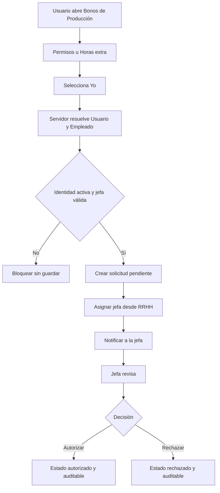

# Autosolicitudes en Bonos de Producción

## Objetivo

Permitir que una persona con cuenta operativa de Producción y ficha activa en
`rrhh.Empleado` pueda solicitar para sí misma los trámites que ya existen dentro
de Bonos de Producción, sin concederle facultades para gestionar o autorizar su
propia solicitud y sin alterar los flujos existentes del equipo.

El alcance incluye únicamente:

- permisos;
- horas extra.

Vacaciones y préstamos permanecen fuera de Bonos de Producción porque hoy no
forman parte de esa aplicación y tienen contratos propios en Capital Humano.

## Situación actual confirmada

La aplicación de Bonos construye sus selectores a partir del personal elegible
del periodo y del personal que el usuario puede gestionar. No agrega
explícitamente al empleado vinculado al usuario actual.

Por ello una persona como Julissa Angulo, aunque tenga una ficha activa, una
cuenta operativa y una jefa directa válida, no aparece en su propio selector si
no participa en bonos o no forma parte de su propio equipo directo.

La cuenta operativa y la identidad laboral son responsabilidades distintas:

- `auth.User` conserva las credenciales y grupos;
- `rrhh.Empleado` conserva la identidad laboral y jerarquía;
- `Empleado.usuario_erp` es el vínculo canónico entre ambas;
- `Empleado.jefe_directo` determina la persona responsable de autorizar.

## Enfoque elegido

Se introduce una política explícita de autosolicitud dentro de Bonos. La
solución no debe resolver el caso agregando simplemente al usuario al selector
de equipo, porque eso mezclaría la capacidad de solicitar con las facultades de
editar, eliminar o autorizar.

El backend distinguirá siempre estas capacidades:

```python
can_solicitar_empleado(empleado)
can_gestionar_empleado(empleado)
```

Para el empleado vinculado a la sesión:

- `can_solicitar_empleado` será verdadero;
- `can_gestionar_empleado` será falso.

Para el equipo autorizado se conservarán las reglas existentes de jerarquía,
roles y acceso administrativo.

## Reglas funcionales

### Elegibilidad para autosolicitud

Una persona podrá solicitar para sí misma cuando se cumplan todas estas
condiciones:

1. El usuario está autenticado.
2. Existe una ficha `Empleado` activa vinculada mediante `usuario_erp`.
3. La ficha pertenece al ámbito de Producción.
4. Existe una jefa directa activa vinculada a un usuario ERP.

La autosolicitud no dependerá de `participa_bonos_produccion` ni de la existencia
de un registro en `BonoProduccionEmpleado`. Un trámite laboral no debe quedar
condicionado a la elegibilidad económica del bono.

Si falta una jefa directa válida, el backend bloqueará la creación antes de
guardar y devolverá un mensaje operativo que indique solicitar la corrección de
jerarquía a Capital Humano.

### Presentación en la interfaz

El empleado propio se agregará una sola vez al conjunto de personas disponible.
El payload lo marcará explícitamente:

```json
{
  "id": 47,
  "empleado_nombre": "ANGULO PARRA JULISSA",
  "es_usuario_actual": true,
  "puede_solicitar": true,
  "puede_gestionar": false
}
```

La interfaz mostrará ese registro primero y con la etiqueta:

> Yo — Julissa Angulo

La UI no inferirá la identidad comparando nombres, correos ni posiciones en la
lista.

### Creación de permisos

Al crear un permiso propio:

1. El backend resolverá nuevamente el empleado desde la sesión.
2. Validará que el ID enviado corresponda a ese empleado o a una persona que el
   usuario realmente pueda gestionar.
3. Conservará `origen_solicitud=bonos_produccion`.
4. Guardará el permiso en las tablas actuales de RRHH.
5. Mantendrá el estado pendiente aplicable.
6. Ejecutará `notificar_permiso_solicitado`.
7. La jerarquía existente dirigirá la decisión a la jefa directa.

El navegador no podrá elegir ni sustituir a la autorizadora.

### Creación de horas extra

Al crear horas extra propias:

1. El backend resolverá nuevamente el empleado desde la sesión.
2. Validará fecha, cantidad positiva y motivo.
3. Conservará la protección contra registros activos duplicados para el mismo
   empleado y fecha.
4. Guardará el registro con estado pendiente.
5. Resolverá `jefe_directo` mediante
   `usuario_jefe_directo_de_empleado(empleado)`.
6. Notificará a la jefa directa mediante el mecanismo existente de horas extra.

La implementación deberá revisar la ausencia actual de notificación explícita
en el flujo de equipo y uniformar el comportamiento solamente si puede hacerlo
sin cambiar destinatarios ni permisos de Bonos de Ventas.

## Seguridad y segregación de funciones

Las siguientes reglas son invariantes:

- Una persona nunca podrá autorizar ni rechazar su propia solicitud.
- El ID recibido desde el cliente no será fuente suficiente de autorización.
- La jefa directa se calculará en el servidor desde RRHH.
- Solo la jefa directa asignada o un superusuario podrán resolver horas extra.
- Los permisos conservarán el flujo jerárquico y de RRHH actualmente vigente.
- Una solicitud histórica conservará a su responsable asignada aunque la
  jerarquía laboral cambie posteriormente.
- No se modificarán grupos, `UserModuleAccess` ni acceso global al ERP.

En esta primera entrega, el empleado propio podrá crear y consultar sus
solicitudes, pero no editarlas ni eliminarlas desde Bonos. Una corrección será
realizada o rechazada por la jefa directa mediante los flujos auditados
existentes. Esta restricción evita ampliar el contrato de auditoría dentro del
mismo cambio.

## Arquitectura técnica

### Composición del personal disponible

`PermisosProduccionEquipoViewSet` seguirá componiendo el personal elegible del
periodo, el equipo directo y el alcance administrativo. A esa composición se
agregará el empleado propio activo, con deduplicación por ID y con una marca
explícita en su payload.

`HorasExtraProduccionEquipoViewSet` reutilizará la misma composición para evitar
divergencias entre Permisos y Horas extra.

### Hooks compartidos

Los ViewSets base de `rrhh/bonos_permisos.py` y
`rrhh/bonos_horas_extra.py` son consumidos también por Bonos de Ventas. Si la
implementación agrega `can_solicitar_empleado`, su comportamiento predeterminado
debe preservar exactamente el contrato vigente de cada consumidor.

Producción especializará el hook para permitir:

- solicitar para el empleado propio;
- solicitar o gestionar para el equipo cuando las reglas actuales lo permitan;
- negar gestión posterior cuando el beneficiario sea el empleado propio.

La autorización seguirá usando las funciones existentes; no se creará una ruta
paralela ni un segundo sistema de estados.

## Estados y flujo



## Errores esperados

- Usuario sin ficha activa: no se muestra “Yo” y el servidor rechaza una
  solicitud manipulada.
- Usuario sin jefa directa válida: respuesta de validación sin crear registro.
- Empleado ajeno enviado manualmente: `400` o `403`, sin efectos laterales.
- Horas no positivas, fecha inválida o motivo vacío: conserva las validaciones
  actuales.
- Hora extra activa duplicada en la misma fecha: conserva el rechazo actual.
- Intento de autoautorización, edición o eliminación: `403`, sin cambio de
  estado ni auditoría falsa.

## Archivos dentro del alcance

- `bonos_produccion/views.py`
- `rrhh/bonos_horas_extra.py`
- `rrhh/bonos_permisos.py`, solamente si se necesita el hook simétrico
- `bonos_produccion/templates/bonos_produccion/index.html`
- `bonos_produccion/tests.py`
- tests focalizados de `bonos_ventas` para compatibilidad compartida
- service worker de Bonos de Producción si cambia un recurso cacheado

No están dentro del alcance:

- modelos o migraciones;
- vacaciones y préstamos;
- nómina y cálculo de bonos;
- roles, grupos o `UserModuleAccess`;
- reasignación de datos históricos;
- rediseños generales de la aplicación.

## Matriz de pruebas

| Caso | Resultado esperado |
| --- | --- |
| Empleado propio consulta Permisos | Aparece “Yo” una sola vez |
| Empleado propio consulta Horas extra | Aparece “Yo” una sola vez |
| No participa en bonos | Sigue disponible para autosolicitud |
| Crea permiso propio | Pendiente y notificado a la jefa |
| Crea horas extra propias | Pendiente y asignada a la jefa |
| Manipula el ID de empleado | Rechazado y sin registro |
| Intenta autorizar lo propio | `403` y permanece pendiente |
| Intenta editar o eliminar lo propio | `403` y permanece sin cambios |
| Jefa consulta el equipo | Conserva a la persona y al resto del equipo |
| Jefa autoriza o rechaza | Estado y auditoría correctos |
| Superusuario actúa como respaldo | Conserva la capacidad existente |
| Usuario sin ficha o con ficha inactiva | No puede autosolicitar |
| Usuario sin jefa válida | No se crea solicitud |
| Hora extra duplicada | Conserva la validación existente |
| Bonos de Ventas | Sin cambios funcionales |
| Captura y cálculo de bonos | Sin cambios funcionales |
| Registros históricos | Sin reasignación ni cambio de estado |

Las pruebas funcionales se escribirán antes del código y deberán fallar por la
ausencia del nuevo contrato, no por errores de configuración.

## Validación y entrega

La implementación se realizará en un worktree y rama exclusivos desde
`origin/main`. Antes de editar se aplicarán todas las migraciones vigentes y se
confirmará:

```bash
python manage.py migrate --check
python manage.py check
```

La validación mínima incluirá:

```bash
python manage.py test bonos_produccion.tests
python manage.py test bonos_ventas.tests
python manage.py test rrhh.tests
python manage.py migrate --check
python manage.py check
```

En navegador se comprobarán el selector “Yo”, la creación de ambos tipos de
solicitud, la ausencia de acciones propias, la bandeja de la jefa, la decisión
de autorización o rechazo y la consola y las solicitudes Network/XHR.

Si cambia HTML o JavaScript cacheado por la PWA, el mismo commit incrementará
`CACHE_NAME` y el despliegue ejecutará `collectstatic`.

El PR será inicialmente borrador, contendrá únicamente este alcance y no podrá
mergearse con checks fallidos. Después del merge se ejecutará
`scripts/deploy_web_safe.sh` en el VPS y se validará el flujo con las cuentas
reales. Una respuesta API o un registro en base de datos no bastarán: la
solicitud deberá ser visible y resoluble para la jefa en producción.

La rama local y remota se eliminarán únicamente después del merge, despliegue y
validación productiva.
