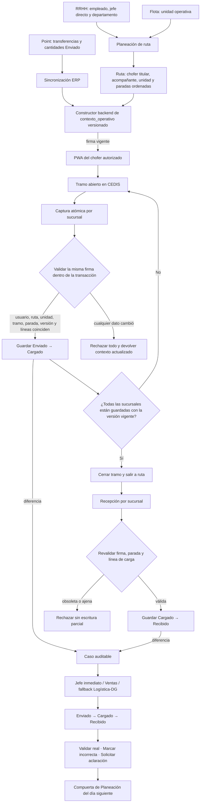

# Logística: carga por sucursal con contexto operativo

## Objetivo

Simplificar la revisión física de carga en el PWA. El repartidor debe confirmar una sucursal completa por vez, con las cantidades `Enviado` de Point precargadas y editables, en lugar de confirmar producto por producto.

El cambio también debe centralizar la autorización y consistencia de la ruta en un `contexto_operativo` versionado para impedir que usuarios, unidades, tramos, productos o reintentos offline obsoletos se mezclen.

## Alcance

- PWA de Logística para el chofer titular de la ruta.
- API y servicios de checklist de carga.
- Tramos delimitados por paradas CEDIS.
- Captura masiva y atómica por sucursal.
- Registro y revisión posterior de diferencias por el jefe inmediato.
- Bloqueo de Planeación al día siguiente cuando existan diferencias vencidas sin clasificar.
- Notificaciones, auditoría, pruebas y versionado del service worker.

No se modifica el contrato operativo del acompañante: puede estar planeado y visible, pero no opera la ruta ni el checklist.

## Contexto operativo canónico

El backend construirá el contexto; el cliente no decidirá qué ruta, unidad, tramo o acciones están permitidas.

```text
contexto_operativo
├── ruta_id
├── chofer_autorizado_id
├── unidad_id
├── tramo_id
├── parada_cedis_origen_id
├── version_checklist
├── sucursales_permitidas
├── productos_permitidos
└── acciones_permitidas
```

### Invariantes

1. `chofer_autorizado_id` corresponde al repartidor titular, nunca al acompañante.
2. `unidad_id` procede de la ruta activa; el perfil del usuario no puede sustituirla.
3. `tramo_id` identifica de forma estable el intervalo entre la salida de CEDIS y el siguiente CEDIS.
4. `version_checklist` cambia cuando Point o el ERP modifica las líneas operativas del tramo.
5. Cada sucursal y producto aceptado debe pertenecer al contexto vigente.
6. Toda mutación incluye un identificador idempotente.
7. El servidor valida de nuevo el contexto dentro de la transacción de guardado.

### Diagrama integral y punto único de coincidencia



La PWA no compara por separado todos estos identificadores para decidir qué hacer. Recibe una firma opaca del contexto; el backend es quien resuelve sus componentes y la invalida cuando cambia cualquiera de ellos. Esto reduce múltiples coincidencias simultáneas a una sola condición operacional: **la firma presentada sigue siendo la vigente y todas las líneas pertenecen a ella**.

La firma no sustituye las llaves de auditoría. Ruta, chofer, unidad, tramo, parada, sucursal y línea se siguen guardando de forma explícita para poder explicar cualquier rechazo o diferencia.

## Flujo del repartidor

### 1. Resumen del tramo

La pantalla muestra únicamente las sucursales del tramo operativo actual. Cada botón incluye nombre, número de productos y estado:

- `Pendiente`
- `Guardada`
- `Guardada con diferencias`

`Salir a ruta` permanece deshabilitado hasta que todas las sucursales estén guardadas.

### 2. Captura de una sucursal

Al seleccionar una sucursal:

- Los productos aparecen en orden alfabético.
- Un buscador compacto filtra por nombre o código.
- Cada fila muestra nombre, código cuando exista, cantidad `Enviado`, unidad y campo de cantidad cargada.
- La cantidad cargada inicia con el valor `Enviado` de Point.
- Todos los campos permanecen editables mientras el tramo siga abierto en CEDIS.
- Una cantidad modificada se resalta visualmente sin saturar la lista.
- `Guardar sucursal` permanece fijo al pie de la pantalla en celular.

### 3. Popup de diferencias

Al pulsar `Guardar sucursal`:

- Si ninguna cantidad cambió, se guarda directamente.
- Si existen cambios, se abre un único modal sobre la captura; no se navega a otra pantalla.
- El modal contiene únicamente los productos modificados.
- Cada diferencia muestra `Enviado → Cargado`, exige un motivo y admite nota opcional.
- Cerrar el modal, incluso tocando `Cancelar`, conserva todas las cantidades capturadas y devuelve el foco a `Guardar sucursal`.
- Confirmar envía la sucursal completa.

Motivos iniciales:

- Faltante físico.
- Producto dañado.
- Error en Point.
- Cambio autorizado.
- Otro.

### 4. Guardado y cierre del tramo

El guardado por sucursal es atómico: se aplican todas sus líneas o ninguna.

Después de guardar, el PWA regresa al resumen del tramo. Una sucursal puede abrirse y editarse nuevamente mientras no se haya ejecutado `Salir a ruta`.

Al pulsar `Salir a ruta`:

- Todas las sucursales deben estar guardadas con la versión vigente.
- El tramo queda cerrado para edición de carga.
- Durante el recorrido solo se confirman entregas; no se reescribe lo que salió de CEDIS.

## Contrato de captura masiva

La mutación por sucursal incluirá:

```json
{
  "ruta_id": 64,
  "tramo_id": "cedis-271:ordenes-4-5",
  "sucursal_id": 7,
  "version_checklist": "sha256:...",
  "client_event_id": "uuid",
  "lineas": [
    {
      "linea_id": 20554,
      "source_hash": "25ef52b3be93c594d2a4",
      "cantidad_cargada": "2.000",
      "motivo_diferencia": "",
      "notas": ""
    }
  ]
}
```

El backend responderá con el contexto y resumen actualizados. Los errores de consistencia usarán códigos explícitos:

- `contexto_obsoleto`
- `tramo_cambiado`
- `checklist_actualizado`
- `sucursal_no_permitida`
- `producto_no_vigente`
- `motivo_diferencia_requerido`

Cuando el contexto cambie, la respuesta incluirá los productos afectados para que el PWA pueda recargar sin un mensaje genérico.

## Offline e idempotencia

- La captura offline conserva ruta, tramo, sucursal y versión del checklist.
- Solo se reintenta si el contexto sigue vigente.
- Al cambiar de tramo se eliminan capturas encoladas del tramo anterior.
- Un `client_event_id` repetido devuelve el resultado previo y no duplica cambios ni notificaciones.
- Una captura rechazada nunca se aplica parcialmente.

## Diferencias y revisión del jefe

Las diferencias no bloquean la ruta actual.

### Dos momentos de discrepancia

El sistema distingue el lugar operativo donde apareció la diferencia:

1. **Diferencia de carga en CEDIS:** compara la cantidad `Enviado` de Point contra la cantidad físicamente `Cargado` y confirmada antes de salir.
2. **Diferencia de recepción en sucursal:** compara la cantidad `Cargado` que salió de CEDIS contra la cantidad `Recibido` al cerrar la entrega.

No se sobrescribe una diferencia con la otra. Cada evento conserva su propio motivo, nota, responsable, fecha y evidencia. El jefe recibe una trazabilidad conjunta por producto:

```text
Enviado por Point → Cargado en CEDIS → Recibido en sucursal
```

Esto permite distinguir entre un faltante de origen, una incidencia durante el traslado y una diferencia en la recepción o captura de la sucursal.

Cuando `Cargado` y `Recibido` no coincidan, el cierre de entrega solicitará motivo y nota; la evidencia será obligatoria únicamente para los motivos que la política operativa defina. La discrepancia se registra y la entrega puede finalizar sin quedar bloqueada.

Al guardar una sucursal con diferencias se crea un caso auditable por producto y se asigna a:

1. `jefe_directo` del empleado vinculado al chofer en RRHH.
2. Responsable del departamento que tiene a cargo Logística; actualmente Ventas.
3. Fallback de Logística/DG cuando no exista una relación válida.

El jefe dispone de tres acciones:

- `Validar como real`.
- `Marcar como incorrecta`.
- `Solicitar aclaración`.

Cada decisión conserva usuario, fecha, estado anterior, comentario y evidencia de ruta. La revisión no cambia automáticamente las cantidades históricas.

## Deuda obligatoria al día siguiente

La ruta con diferencias puede continuar y finalizar el mismo día.

Al entrar a Planeación en una fecha posterior, el jefe responsable debe atender primero las diferencias pendientes de días anteriores. Mientras existan casos vencidos sin clasificar:

- Puede consultar la bandeja obligatoria.
- No puede crear ni modificar la planeación nueva.
- El bloqueo muestra las diferencias que faltan y enlaces directos para resolverlas.

Los casos en `Solicitar aclaración` cuentan como atendidos por el jefe y no mantienen el bloqueo de Planeación; quedan en seguimiento separado con el repartidor. Así, el jefe no puede omitir la revisión, pero una aclaración pendiente del operador tampoco paraliza toda la planeación.

## Diseño móvil y marca

La implementación seguirá `PRODUCT.md`, `DESIGN_STACK.md` y los patrones vigentes de la App Operativa.

- Paleta vino, dorado y fondos claros de Pollyana's Dolce.
- Títulos editoriales y controles operativos legibles.
- Una fila compacta por producto; no una tarjeta grande por producto.
- Cantidad y unidad alineadas a la derecha.
- Buscador y encabezado compactos.
- Acción principal fija al pie respetando safe areas.
- Modal de diferencias con foco atrapado, cierre por Escape y retorno de foco.
- Contraste, objetivos táctiles y mensajes accesibles.

## Modelo de estados

### Sucursal del tramo

```text
PENDIENTE → GUARDADA
PENDIENTE → GUARDADA_CON_DIFERENCIAS
GUARDADA* → PENDIENTE_EDITADA → GUARDADA*
GUARDADA* → CERRADA_AL_SALIR
```

### Revisión de diferencia

```text
PENDIENTE_JEFE → VALIDADA_REAL
PENDIENTE_JEFE → MARCADA_INCORRECTA
PENDIENTE_JEFE → ACLARACION_SOLICITADA
ACLARACION_SOLICITADA → VALIDADA_REAL | MARCADA_INCORRECTA
```

## Pruebas de aceptación

1. El chofer titular recibe contexto; el acompañante no puede operar.
2. La unidad procede de la ruta activa.
3. Solo aparecen las sucursales y productos del tramo actual.
4. Productos ordenados alfabéticamente y filtrables por buscador.
5. Cantidades `Enviado` precargadas y editables.
6. Guardado completo sin diferencias.
7. Popup único para múltiples diferencias con motivo obligatorio por producto.
8. Fallo en cualquier línea revierte toda la sucursal.
9. Cambio de Point produce `checklist_actualizado` con detalle, sin escritura parcial.
10. Reintento idempotente no duplica registros.
11. Mutación offline vieja no cruza de tramo.
12. Sucursal editable antes de `Salir a ruta` y bloqueada después.
13. Salida habilitada solo con todas las sucursales guardadas.
14. Diferencias asignadas al jefe directo/Ventas y fallback Logística/DG.
15. Las tres decisiones del jefe quedan auditadas.
16. La ruta actual nunca se bloquea por diferencias.
17. El cierre de entrega compara `Cargado` contra `Recibido` sin sustituir la diferencia de carga previa.
18. El jefe visualiza `Enviado → Cargado → Recibido` y el origen operativo de cada discrepancia.
19. Una diferencia de recepción genera un caso auditable sin impedir finalizar la entrega.
20. Planeación posterior se bloquea por pendientes vencidos y se habilita al clasificarlos.
21. PWA validada en celular, consola y Network; service worker versionado y desplegado.

### Matriz contra recurrencia diaria

Estas pruebas se escribirán primero y deberán fallar antes de implementar el contexto canónico:

| Escenario forzado | Resultado obligatorio |
| --- | --- |
| El acompañante reutiliza una URL o payload del chofer | `403`; cero cambios |
| El chofer cambia de unidad después de abrir el PWA | `contexto_obsoleto`; cero cambios |
| Planeación reasigna chofer o unidad durante la captura | Firma invalidada; recarga obligatoria |
| Point cambia una cantidad con la sucursal abierta | `checklist_actualizado`; se informa la línea afectada |
| La ruta avanza al siguiente tramo con una petición offline pendiente | `tramo_cambiado`; no se aplica al tramo nuevo |
| Se reenvía el mismo `client_event_id` con el mismo payload | Devuelve el resultado anterior; un solo evento |
| Se reenvía el mismo `client_event_id` con otro payload | Conflicto de idempotencia; cero cambios |
| Una línea de 25 no pertenece a la sucursal o versión | Se revierten las 25 líneas |
| Dos dispositivos guardan la misma sucursal simultáneamente | Solo una versión gana; la otra recibe contexto obsoleto |
| Se intenta editar carga después de `Salir a ruta` | Rechazo; historial intacto |
| Recepción referencia una línea `SUPERADA` o de otro tramo | Rechazo; entrega no se corrompe |
| `Recibido` difiere de `Cargado` | Entrega finaliza y crea caso de recepción separado |
| Falla la asignación del jefe directo | Se usa Ventas y después fallback Logística/DG |
| Existen pendientes vencidos al abrir Planeación | Solo abre la bandeja; crear/editar queda bloqueado |

Además de pruebas unitarias, habrá pruebas transaccionales con PostgreSQL usando `select_for_update`, dos clientes concurrentes y verificación posterior de conteos. La validación final repetirá el flujo en un celular real con cola offline, cambio de tramo, consola, Network y service worker actualizado.

### Condición para afirmar que el problema quedó reducido

No bastará con que el flujo normal funcione. Solo se considerará resuelto el riesgo de “varios datos que deben coincidir” cuando:

1. Todas las mutaciones de carga y recepción exijan la firma canónica.
2. Ningún endpoint operativo reconstruya permisos o tramo con una regla paralela.
3. Las pruebas de desincronización y concurrencia anteriores pasen en PostgreSQL.
4. Los rechazos de contexto no produzcan escrituras parciales ni mensajes genéricos.
5. El mismo recorrido pase online, offline/reintento y después de actualizar el service worker.

## Entrega y validación

La implementación se hará en una rama/worktree limpio y deberá completar:

1. Pruebas de servicios y API con PostgreSQL.
2. Pruebas del contrato JavaScript del PWA.
3. Validación local autenticada en navegador móvil.
4. PR, CI, merge y deploy mediante `scripts/deploy_web_safe.sh`.
5. `collectstatic` y actualización del service worker.
6. Validación en producción con un usuario/recorrido real antes de declarar terminado.
