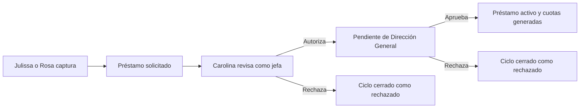

# Operadoras de solicitudes de Producción

## Objetivo

Corregir el acceso sobredimensionado de Julissa Angulo y habilitar a Rosa Icela
Cervantes como operadoras acotadas de Producción. Ambas podrán capturar permisos
y préstamos para sí mismas o para personal activo del departamento de
Producción, sin recibir administración general del módulo, sin autorizar
solicitudes y sin alterar datos históricos.

La cadena de decisión permanece separada de la captura:

- Carolina Cayetano revisa y resuelve los permisos de Producción;
- Carolina Cayetano da la primera autorización a los préstamos;
- Dirección General da la aprobación final del préstamo;
- Julissa y Rosa nunca pueden resolver una solicitud que hayan capturado ni una
  solicitud propia.

## Estado confirmado en producción

- `ANGULO PARRA JULISSA` está activa, vinculada a `julissa.angulo` y tiene a
  Carolina Cayetano como jefa directa.
- `julissa.angulo` pertenece hoy al grupo general `PRODUCCION`. Ese grupo le da
  acceso efectivo de administración y navegación a Bonos, planes, recetas,
  costeo, MRP, reabasto CEDIS y reportes. Ese alcance excede la necesidad
  operativa confirmada.
- `CERVANTES GUTIERREZ ROSA ICELA` está activa, pertenece al departamento
  `PRODUCCION`, tiene a Carolina como jefa directa y no tiene usuario ERP.
- El grupo acotado `bonos_produccion_captura` existe y no tiene usuarios en
  producción.
- Hay 27 empleados activos en Producción: 26 tienen a Carolina como jefa
  directa; la única persona sin jefa dentro de ese conjunto es Carolina.
- La PWA de Bonos ya permite capturar permisos para el personal visible, pero
  no tiene flujo de préstamos.
- La PWA de Capital Humano permite préstamos propios. Su API impide actualmente
  que una persona sin acceso RRHH solicite para otro empleado.

## Enfoque elegido

Se usará un perfil operativo explícito y de mínimo privilegio. No se copiará el
grupo general `PRODUCCION` ni se simulará seguridad ocultando solamente enlaces.

El grupo `bonos_produccion_captura` será la señal canónica para este perfil. Su
alcance será:

1. entrar a la PWA de Bonos de Producción;
2. consultar el catálogo necesario de personal activo de Producción;
3. capturar permisos para el personal elegible;
4. capturar préstamos para el personal elegible;
5. consultar únicamente las solicitudes necesarias para confirmar su captura;
6. cerrar sesión y renovar autenticación.

El perfil no concederá `manage` al módulo `produccion`, permisos RRHH, ni acceso
a planes, recetas, costeo, MRP, reportes, nómina o configuración de bonos.

## Identidad y cuentas

`rrhh.Empleado` seguirá siendo la identidad laboral y `auth.User` únicamente la
credencial. El vínculo canónico será `Empleado.usuario_erp`.

- Julissa conservará `julissa.angulo`, pero saldrá del grupo general
  `PRODUCCION` y entrará a `bonos_produccion_captura`.
- Se creará `rosa.cervantes`, usando el correo ya registrado en su ficha, y se
  vinculará exclusivamente con el empleado código `348`.
- Rosa entrará a `bonos_produccion_captura`.
- Antes de aplicar se verificará que no exista otra cuenta o vínculo coincidente.
- La creación y reasignación se hará dentro de una transacción, con lecturas
  antes y después y registro en `AuditLog`.
- La contraseña temporal no se guardará en código, commits, logs ni memoria.

No se modificarán nombres, códigos, áreas, departamentos, jefaturas, historiales
ni solicitudes existentes.

## Personal elegible

Una operadora podrá capturar para una persona cuando el servidor confirme todas
estas condiciones:

1. `Empleado.activo=True`;
2. `departamento=PRODUCCION` o `departamento_origen=PRODUCCION`;
3. existe una jefa directa activa;
4. la jefa directa tiene usuario ERP activo.

La lista no dependerá de `participa_bonos_produccion`: un trámite laboral no
debe depender de que la persona cobre bono.

Carolina no aparecerá como beneficiaria capturable mientras no tenga jefa
directa configurada. La ausencia de cadena válida debe fallar cerrada y no debe
ser sustituida con un autorizador inventado.

## Captura de permisos

La PWA de Bonos conservará el selector de empleados, pero distinguirá la
capacidad de capturar de la capacidad de gestionar.

Para Julissa y Rosa:

- `puede_solicitar=True` para sí mismas y para el personal elegible;
- `puede_gestionar=False` para todos;
- no se muestran ni aceptan acciones de editar, eliminar, preautorizar,
  rechazar o resolver;
- el servidor vuelve a validar el empleado enviado, sin confiar en el selector;
- `origen_solicitud=bonos_produccion` se conserva;
- la notificación se envía a Carolina a través de la jefatura registrada del
  empleado.

Los permisos existentes y sus estados no se reasignan ni recalculan.

## Captura de préstamos

Los préstamos se incorporarán a la superficie operativa de Bonos de Producción
mediante un endpoint específico de Producción. No se abrirá la API genérica de
RRHH ni se concederá acceso RRHH al grupo.

La operadora seleccionará al empleado y capturará concepto, método de pago,
importe, número de quincenas y fecha propuesta de depósito. El servidor:

1. valida el alcance del empleado;
2. rechaza importes o plazos inválidos;
3. aplica la regla existente que bloquea un nuevo préstamo cuando el empleado
   conserva saldo vigente;
4. calcula el descuento quincenal con la regla actual;
5. crea el préstamo en estado `solicitado`;
6. asigna como jefa a la usuaria ERP de la jefa directa registrada, que para el
   personal elegible actual es Carolina;
7. registra a la operadora como `creado_por`;
8. ejecuta la notificación existente.

La captura no podrá alterar estado, firmas, saldo, cuotas, autorizadores ni
fechas de autorización recibidos desde el cliente.

Después de la captura, el flujo existente permanece sin duplicación:

Dirección General seguirá usando el flujo vigente; esta entrega no modifica sus
facultades ni la generación de cuotas.

## Visibilidad y privacidad

Las operadoras necesitan confirmar que una captura fue recibida, pero no
requieren consultar el historial financiero completo de toda Producción.

- La respuesta de creación mostrará folio, empleado, estado y resumen de la
  solicitud recién creada.
- La lista operativa mostrará solicitudes creadas por la propia operadora y las
  solicitudes donde ella es beneficiaria.
- No mostrará cuotas, cuentas bancarias, CLABE, nómina ni préstamos históricos
  ajenos.
- Carolina y Dirección conservarán sus bandejas existentes.

## Seguridad e invariantes

- El ID del empleado se valida en el servidor contra el alcance de Producción.
- Ninguna operadora obtiene `can_manage_submodule`.
- Ninguna operadora puede aprobar o rechazar permisos o préstamos.
- Ninguna operadora puede editar o eliminar después de enviar.
- La jefa y Dirección se resuelven en servidor; el cliente no los elige.
- La interfaz bloquea únicamente el botón presionado mientras la solicitud está
  en curso. Para préstamos, la validación transaccional de deuda impide crear un
  segundo crédito vigente; para permisos, una respuesta incierta no se
  reintentará automáticamente.
- Los errores conservan los datos capturados y permiten reintento.
- El éxito se muestra mediante el toast global o el mecanismo accesible de la
  PWA, con folio visible.
- Los endpoints administrativos actuales mantienen sus permisos.
- Bonos de Ventas no cambia.
- No se modifican modelos ni migraciones salvo que una prueba demuestre una
  necesidad imposible de cubrir con los campos existentes; en ese caso se
  detendrá la implementación y se solicitará una nueva aprobación.

## Cambios de acceso en producción

La mutación productiva se hará después de merge y deploy del soporte de código.
El orden será:

1. lectura y respaldo lógico de grupos, vínculos y permisos actuales de Julissa
   y Rosa;
2. vista previa exacta de altas, bajas y vínculos;
3. aplicación atómica;
4. lectura fresca de las dos cuentas y del grupo;
5. autenticación real de cada perfil;
6. verificación de rutas permitidas y denegadas;
7. prueba de captura sin aprobar solicitudes reales de terceros.

La remoción de Julissa del grupo `PRODUCCION` no ocurrirá antes de que el nuevo
perfil esté desplegado y validado. Si la nueva navegación falla, se restaurará
su grupo anterior y no se continuará con Rosa.

## Compatibilidad y efectos secundarios que deben descartarse

- Cálculo y pago de bonos.
- Captura de asistencia, puntualidad, uniforme o producción.
- Bonos extra y ajustes manuales de nómina.
- Permisos y préstamos históricos.
- Aprobaciones de Carolina.
- Bandeja y aprobación final de Dirección General.
- Bonos de Ventas.
- Navegación de usuarios generales de Producción.
- Usuarios RRHH, ADMIN y superusuarios.
- Service worker y caché de clientes que no pertenezcan a esta PWA.

Si cambia HTML o JavaScript cacheado de Bonos, se incrementará `CACHE_NAME` en
el mismo commit y se validará la versión servida después de `collectstatic`.

## Pruebas de aceptación

| Caso | Resultado esperado |
| --- | --- |
| Julissa inicia sesión | Entra a la PWA operativa y no al ERP administrativo |
| Rosa inicia sesión | Entra a la misma PWA operativa |
| Operadora consulta personal | Solo personal activo y válido de Producción |
| Operadora captura permiso propio | Creado y enviado a Carolina |
| Operadora captura permiso ajeno | Creado para el empleado seleccionado y enviado a Carolina |
| Operadora intenta editar o resolver permiso | `403`, sin cambios |
| Operadora captura préstamo propio sin deuda | Solicitado y enviado a Carolina |
| Operadora captura préstamo ajeno sin deuda | Solicitado para el empleado y enviado a Carolina |
| Empleado tiene saldo vigente | Rechazo explícito, sin segundo préstamo |
| Operadora manipula empleado de otro departamento | `403` o `400`, sin registro |
| Operadora intenta enviar autorizador o estado | Campos ignorados o rechazados |
| Operadora abre costeo, MRP, recetas o reportes | Acceso denegado o redirección segura |
| Carolina revisa permiso | Conserva Autorizar/Rechazar |
| Carolina autoriza préstamo | Pasa a Dirección General |
| Dirección General aprueba préstamo | Se activa y genera cuotas con la regla vigente |
| Bonos de Ventas | Sin cambios funcionales |
| Históricos antes/después | Mismos conteos, estados y responsables |

Las pruebas se escribirán antes del código y deben demostrar el fallo por la
ausencia del nuevo contrato. La validación mínima incluye:

- pruebas focalizadas de acceso y middleware;
- pruebas de `bonos_produccion` para permisos y préstamos;
- pruebas de `rrhh` para el flujo completo del préstamo;
- regresión de `bonos_ventas`;
- `python manage.py check`;
- `python manage.py migrate --check`;
- navegador real con Julissa, Rosa, Carolina y Dirección General;
- consola, Network/XHR y service worker;
- lectura final de producción en la misma capa servida.

## Archivos y contratos previstos

El plan de implementación se limitará a:

- `core/access.py` y pruebas de acceso;
- `core/middleware.py` solo si la nueva superficie requiere ajustar rutas;
- `bonos_produccion/views.py` y `bonos_produccion/urls.py`;
- `bonos_produccion/templates/bonos_produccion/index.html`;
- `bonos_produccion/tests.py`;
- servicios existentes de préstamos en `rrhh`, sin duplicar estados ni cuotas;
- service worker de Bonos de Producción si cambia la PWA;
- `docs/ux/action-context-coverage.md` por las nuevas acciones.

No se contempla modificar modelos, migraciones, `.env`, puertos, nómina ni
datos históricos.

## Entrega y reversión

La entrega seguirá rama aislada, PostgreSQL local, PR en borrador, revisión,
merge, `scripts/deploy_web_safe.sh` y validación productiva. No se hará `git
pull` manual en el VPS.

La reversión de código será el redeploy del commit anterior. La reversión de
acceso restaurará exactamente los grupos y vínculos capturados en la lectura
previa. Ninguna reversión borrará usuarios, empleados, solicitudes o auditoría.
