# Sincronización automática de servicios a domicilio desde Point

Fecha: 2026-08-07
Estado: aprobado por el usuario
Base ERP: `origin/main` en `e2a36a32`, que ya incluye PR #1217
Base Centro Operativo: `origin/main` en `4bc4046`, que ya incluye PR #48

## Objetivo

Todo ticket marcado por el personal de Point como **Entrega a domicilio** debe aparecer automáticamente en la bandeja canónica del Centro Operativo, sin que call center tenga que capturar folio, fecha o sucursal. La misma orden del ERP seguirá siendo la fuente operativa para cliente, dirección, canal, preparación, repartidor, unidad, ruta y auditoría.

## Evidencia del contrato real de Point

La revisión de producción fue de solo lectura y no imprimió datos personales.

- Point expone `GET /Ventas/getNotasByDateServicioDomicilio` con `fecha_inicio`, `fecha_final` e `id_sucursal`.
- La respuesta identifica las notas de domicilio mediante `PK_Nota`, `Folio`, `Sucursal`, `Fecha_Hora_Cierre`, `Total` y `Facturado`.
- El ticket visible `15616` de Matriz aparece en esa bandeja con la llave técnica `PK_Nota=887410` y total `514.00`.
- `GET /Ventas/getDataClienteById?id_nota=<PK_Nota>` devuelve cliente, dirección de entrega, colonia, números, entrecalles y observaciones.
- `/Clientes/get_clientes_byActivo` permite resolver contacto por `Pk_cliente`; se aceptará el primer teléfono no vacío entre `telefono1` y `telefono2`.
- Los endpoints genéricos de encabezado y detalle de nota entregan productos y total, pero no contienen un indicador de domicilio.
- Las líneas `Servicio Domicilio 1/2/3` representan costos; no son el criterio de identidad del servicio.

Por lo tanto, el único filtro válido para la sincronización es la bandeja específica de Point. No se inferirá un domicilio por nombre de producto, importe ni texto libre del ticket.

## Arquitectura aprobada

```mermaid
flowchart LR
    P["Point: bandeja Entrega a domicilio"] -->|"cada 60 s, ventana solapada"| S["ERP: sincronizador único"]
    S -->|"PK_Nota idempotente"| O["PedidoCliente + SolicitudDomicilio"]
    O --> B["Centro Operativo: bandeja única"]
    B --> C["Call center confirma canal y completa faltantes"]
    C --> A["ERP asigna repartidor y unidad"]
    A --> L["App logística y seguimiento de ruta"]
```

No se crea un segundo agente, una segunda tabla de candidatos ni una base paralela. Celery Beat del ERP programa una tarea; un worker del ERP consulta Point con una sesión HTTP nueva por ejecución.

## Reglas de sincronización

1. Frecuencia nominal: 60 segundos.
2. Ventana consultada: siete días rodantes, configurable, para cubrir el despliegue inicial, cierres retrasados y caídas de varios días sin perder notas.
3. Alcance: se recorren las sucursales Point configuradas y cada consulta abre una sesión en el workspace/sucursal correspondiente. No se asume que la cuenta predeterminada ve todas las sucursales.
4. Exclusión mutua: advisory lock de PostgreSQL; una ejecución solapada termina sin crear trabajo duplicado.
5. Identidad: `point_note_id = PK_Nota`, protegida por la restricción única existente y por la transacción de `link_point_note`.
6. Detalle comercial: se obtiene con el normalizador existente de nota Point usando la misma sesión autenticada de esa sucursal.
7. Cliente y dirección: se toman de los endpoints de domicilio/cliente de Point y se pasan al servicio canónico existente.
8. Cliente Point: el ERP conserva un vínculo único con `PK_Cliente`; dos identificadores Point distintos nunca se fusionan solo por compartir teléfono o correo, y el mismo cliente se reutiliza aun si su contacto está vacío.
9. Canal inicial: `POR_CONFIRMAR`; la bandeja exige que call center elija teléfono, WhatsApp, Facebook, Instagram, mostrador u otro antes de asignar reparto.
10. Propiedad: una configuración selecciona por prefijo o id al cliente API omnicanal que corresponde al BFF. Si no está configurada, solo se acepta exactamente un cliente elegible; cualquier ausencia o ambigüedad falla cerrado.
11. Privacidad: `PointSyncJob` guarda conteos, estados y códigos de error seguros; nunca nombres, teléfonos, direcciones, cookies ni credenciales.

## Flujo de call center

Una nota automática aparece en la bandeja con estado **Canal por confirmar**. Su ficha ya contiene productos, total, cliente y dirección provenientes de Point. Call center:

1. revisa que la persona y dirección sean correctas;
2. selecciona el canal real;
3. agrega referencia social si aplica;
4. completa únicamente contacto o GPS faltantes;
5. guarda y recibe de vuelta la ficha canónica actualizada;
6. asigna repartidor y unidad desde los registros activos del ERP.

Mientras el canal siga `POR_CONFIRMAR` o falte el par GPS, el ERP bloquea la asignación. Intake y asignación bloquean el mismo pedido/domicilio para que una carrera nunca deje repartidor con captura incompleta. El endpoint de cierre no puede reemplazar silenciosamente datos no vacíos de Point: repetir exactamente el mismo intake es idempotente y cambiar datos ya confirmados produce conflicto.

## API canónica

Se agregan dos contratos, siempre bajo autenticación del cliente API omnicanal:

- `GET /api/public/v1/omnichannel/point-delivery-sync/health/`: último intento, último éxito, estado, antigüedad, intervalo y conteos seguros.
- `PATCH /api/public/v1/omnichannel/deliveries/<id>/intake/`: confirma canal y completa campos faltantes en la misma orden.

El BFF del e-commerce valida y reexpone esos contratos. Después del intake registra/reconcilia idempotentemente la identidad externa en su índice técnico existente para que la asignación quede habilitada, pero no persiste una orden paralela.

## Estados y errores

- `NEVER_RUN`: todavía no existe un intento.
- `RUNNING`: existe una ejecución activa; también representa un intento omitido porque otra ejecución mantiene el lock.
- `SUCCESS`: consulta y procesamiento completos.
- `PARTIAL`: Point respondió, pero una o más notas no pudieron normalizarse o ligarse.
- `FAILED`: sesión, contrato, configuración o dependencia impidieron procesar el lote.

Salvo `NEVER_RUN`, health siempre incluye último intento. `age_seconds` mide la edad del último éxito y la interfaz aplica un umbral explícito para distinguir **sincronizando**, **actualizado**, **con retraso** y **requiere revisión**. Nunca transforma un error de sesión o contrato en “nota no encontrada”. El botón manual existente se conserva como diagnóstico/contingencia, no como paso normal.

## Responsive, iPhone y accesibilidad

- Desktop: bandeja y ficha en dos columnas cuando hay ancho suficiente.
- Tablet: columnas flexibles sin solapamiento ni ancho fijo.
- Móvil: una sola columna, controles compactos, objetivo táctil mínimo de 44 px, texto sin truncar información crítica y sin scroll horizontal a 320 px.
- iPhone/PWA: respeto de `safe-area-inset-*`, inputs con al menos 16 px para evitar zoom, teclado que no cubre la acción principal y barra inferior no fija sobre el contenido.
- Estados de carga estables; no se crean tarjetas grandes o botones toscos para un dato que cabe en una fila.
- El diseño conserva vino, dorado y tipografía de Pollyana's Dolce. UI/UX Pro Max se aplica a densidad, tactilidad y jerarquía; Hallmark se usa para retirar texto redundante y patrones genéricos.

## Compatibilidad y no duplicación

- Se conserva la captura manual, los pedidos web automáticos, los borradores `PENDIENTE_POINT`, el reintento de conciliación y la asignación existente.
- La sincronización automática llama al servicio `link_point_note`; no replica su dedupe, snapshot ni transacción.
- Si una nota coincide con un borrador `POINT_PENDING`, se hidrata mediante la conciliación existente preservando canal, cliente y dirección capturados; nunca se crea otra orden ni se repite un error parcial cada minuto.
- El trabajo de PR #1217/#48 es prerequisito y no se reimplementa.
- Una nota ligada manualmente antes de que pase el job se reconoce por `point_note_id` y se omite.
- Una ejecución repetida, concurrente, por sucursales o con ventana solapada debe conservar exactamente un pedido y un domicilio.

## Criterios de aceptación

1. Un fixture de bandeja que incluya una nota sin producto de costo se importa porque Point la marcó como domicilio.
2. Una nota con producto `Servicio Domicilio 2` que no esté en la bandeja no se importa.
3. El ticket 15616 puede localizarse por la bandeja específica y normalizarse con su llave interna, sin usar el código de facturación.
4. Dos ejecuciones concurrentes no duplican pedido, domicilio, cliente, dirección ni auditoría.
5. Una caída de sesión deja salud degradada y reintenta; no crea una orden incompleta.
6. Call center no puede asignar repartidor antes de confirmar canal.
7. Call center no puede asignar repartidor sin GPS; después de completarlo, la app logística recibe la misma dirección y parada.
8. Dos notas del mismo `PK_Cliente` reutilizan cliente aunque no tenga contacto; dos `PK_Cliente` distintos con teléfono compartido permanecen separados.
9. Una nota de entre dos y seis días de antigüedad se recupera durante backfill y una sucursal no se consulta usando por accidente el workspace de otra.
10. El intake deja lista la identidad técnica del BFF para asignación sin exigir una conciliación manual adicional; un fallo local posterior al PATCH se recupera al repetirlo.
11. Una carrera intake/asignación nunca deja repartidor con canal pendiente o GPS incompleto.
12. Las pruebas backend, BFF, componentes, responsive y navegador emulado pasan con salida cero; la prueba en iPhone físico permanece como gate operativo separado.

## Orden de despliegue y rollback

1. Desplegar primero BFF/frontend capaz de leer `POR_CONFIRMAR` y tolerar health ausente en el ERP anterior.
2. Desplegar ERP con `POINT_DELIVERY_SYNC_ENABLED` apagado por defecto.
3. Verificar migraciones, autenticación, cliente API seleccionado y health.
4. Habilitar el schedule de 60 segundos y observar una ejecución fresca.
5. Para rollback, deshabilitar el schedule; no borrar, revertir ni recrear pedidos ya importados.
